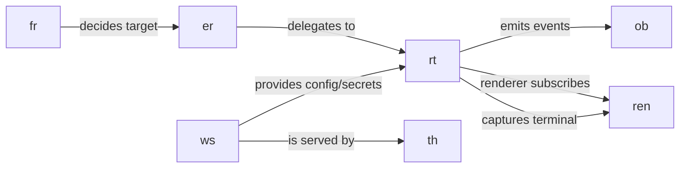

# Goble — Architecture Document Graph

This folder is the **planning tree + tracker** for the whole Goble product architecture. Each numbered folder is a subsystem; its `README.md` is a **surface document** (a short high-level map of that subsystem, its boundaries, and what it talks to), and the leaf docs under it detail the complex parts. The tree also encodes the **intended code-module boundaries**, so our eventual implementation maps one-to-one onto this graph.

The root of the repo also has working docs (`docs/ARCHITECTURE.md`, `docs/plans/`, `README.md`) — those describe what is currently built. This folder is the *target architecture* and the tracker for closing the gap.

## Reading order

Start here → `01-vision/README.md` → `02-first-run-and-routing/README.md` → `03-workspace-model/README.md` → `04-agent-runtime/README.md` → `05-execution-router-and-targets/README.md` → `06-renderer/README.md` → `07-observability/README.md`. Folders `08` (threads) and `09` (mobile) are deferred; `10` is cross-cutting platform/perf concerns.

## Glossary

| Term | Meaning |
| --- | --- |
| **Workspace** | The unit of deployment. Holds agents, shared secrets/API keys, an agent-editable TOML config, plugins (skills + MCP servers), workflows, `remember`, personas, deep-research. Lives on the local machine or a remote host. |
| **Agent** | A persona with continuous state; belongs to a workspace; owns a chat + a CWD; spawns sub-agents for routines; can talk to other agents in the same workspace. |
| **Sub-agent** | A disposable agent run for a routine so the main chat is never blocked. |
| **Plugin** | A unit bundling skills (instruction docs) + one or more MCP servers. |
| **MCP server** | A tool server (search, shell, APIs) that the agent downloads/enables dynamically. |
| **Router** | Decides whether a task/agent runs locally or on a remote worker/workspace. |
| **Runtime target** | The concrete place a task executes: local machine, a remote worker, or this machine acting as a worker for the mobile app (Tailscale). |
| **Harness** | The agent execution engine (tools, sub-agents, sandbox, MCP, LLM). Reused from `~/Projects/grok-build` (`xai-*` crates) behind our own renderer. |

## Document graph

This folder is also the **live-work contract** for the model:

- [`RESOLVER.md`](RESOLVER.md) — the single item being resolved *now* + its verification proof.
- [`GUIDE.md`](GUIDE.md) — how to execute here so nothing is lazily dropped and every `[x]` is verified.
- [`TRACKER.md`](TRACKER.md) — the full backlog.

```mermaid
flowchart TB
  root["00-README.md"]
  g["GUIDE.md"] --> r["RESOLVER.md"]
  r --> t["TRACKER.md"]
  g --> t

  root --> v["01-vision/README.md"]
  v --> bd["01-vision/boundaries-and-deferred.md"]

  root --> fr["02-first-run-and-routing/README.md"]
  fr --> nok["02-first-run-and-routing/onboarding-no-model-key.md"]
  fr --> rlr["02-first-run-and-routing/router-local-vs-remote.md"]
  fr --> rb["02-first-run-and-routing/remote-bootstrap.md"]

  root --> ws["03-workspace-model/README.md"]
  ws --> wsp["03-workspace-model/workspace.md"]
  ws --> sst["03-workspace-model/shared-secrets-and-toml.md"]
  ws --> ma["03-workspace-model/multiple-agents.md"]

  root --> rt["04-agent-runtime/README.md"]
  rt --> hrm["04-agent-runtime/harness-reuse-map.md"]
  rt --> asc["04-agent-runtime/agent-state-and-compaction.md"]
  rt --> sa["04-agent-runtime/subagents.md"]
  rt --> tl["04-agent-runtime/tools.md"]
  rt --> mcp["04-agent-runtime/mcp.md"]
  rt --> llm["04-agent-runtime/llm-and-models.md"]
  rt --> iac["04-agent-runtime/inter-agent-communication.md"]
  rt --> sc["04-agent-runtime/sandbox-and-cwd.md"]
  rt --> mem["04-agent-runtime/memory.md"]
  rt --> per["04-agent-runtime/personas.md"]
  rt --> dr["04-agent-runtime/deep-research.md"]

  root --> er["05-execution-router-and-targets/README.md"]
  er --> rtg["05-execution-router-and-targets/runtime-targets.md"]
  er --> exr["05-execution-router-and-targets/execution-router.md"]

  root --> ren["06-renderer/README.md"]
  ren --> rar["06-renderer/renderer-architecture.md"]
  ren --> fc["06-renderer/form-components.md"]
  ren --> rtr["06-renderer/remote-terminal-renderer.md"]
  ren --> ui["06-renderer/ui-spec/00-readme.md"]

  root --> ob["07-observability/README.md"]
  ob --> et["07-observability/executions-and-trace.md"]
  ob --> lg["07-observability/logs.md"]

  root --> th["08-threads-deferred/README.md"]
  root --> mob["09-mobile-deferred/README.md"]

  root --> pl["10-platform-and-performance/README.md"]
  pl --> wgp["10-platform-and-performance/wgpu-renderer-platform.md"]
  pl --> perf["10-platform-and-performance/performance.md"]
```

## Cross-links between subsystems

## Status legend

Each doc carries a live status in its header and its `Tasks` use the same markers:

- `[ ]` not started
- `[~]` in progress
- `[x]` done / validated

The aggregated, ordered work list lives in [`TRACKER.md`](TRACKER.md).

## Conventions

- **No UI libraries.** The renderer is written from scratch on `wgpu` + Rust; the harness is reused, the renderer is ours.
- **Design direction comes from `~/Projects/warp-new`.** We take the UI direction, design system/interaction, the icon SVG set (`app/assets/bundled/svg`), and the theme/token model (`app/src/themes/`) from there. `warp-new`'s `octomusui` is a reference for a from-scratch Rust renderer; our renderer is `goble-ui` with the shell tree built in `app/src/ui`. (See [`06-renderer/README.md`](06-renderer/README.md).)
- **Surface documents are short** (≤ ~60 lines). Detail lives in the leaf docs; the README only maps the subsystem and links down.
- **English**, matching the rest of the repo.
- **One subsystem per folder.** If a feature is genuinely complex, split it into subfolders/leaf docs here rather than growing one document.
- **Never duplicate the backlog.** `TRACKER.md` is the one full list; `RESOLVER.md` records the item in flight; each owning doc carries that item's detail.
