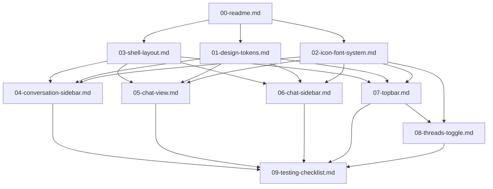

# Goble Native Desktop UI — Design Document Graph

This folder contains the design specs for the real layered Goble native desktop UI built in Rust (`goble-ui` + `goble-desktop-native`).

The implementation is driven by the master plan in this conversation:

- Plan ID: `1914c07e-9ab5-4627-b674-35b8f70ad7b6`
- Branch: `feature/agent-guide-ui`

## Document graph

## Four main UI sections

1. **Topbar** — macOS traffic lights + title on the left; `threads` toggle, `inbox`, `user settings` on the right.
2. **Left sidebar — conversation list** — search + create button, scrollable conversation cards, fixed `Plugins` footer.
3. **Chat view** — header with conversation name + right-sidebar toggle, message bubbles, bottom composer.
4. **Right chat-sidebar** — `Computer Use` preview and `Routines` list.

## Principles

- Build natively in Rust; no emoji icons.
- All icons come from real SVG assets copied from `~/Projects/warp-new/app/assets/bundled/svg/` and rendered through an `IconAtlas`.
- Text uses the bundled Roboto family with real `fontdue` metrics.
- All colors, spacing, radii, and fonts are taken from `goble-ui/src/theme.rs` tokens.
- Components paint hover / selected backgrounds from `InteractiveState`.

## Status legend

Use inline checkmarks in each doc while implementing:

- `[ ]` not started
- `[~]` in progress
- `[x]` done / validated
