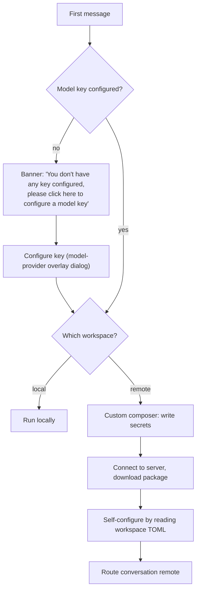

# 02 — First-run & local/remote routing

**Status:** `[~]` — the banner → model-provider overlay dialog → local/remote → continue-local flow is implemented + integration-tested. Harness + real model stream and the `local` runtime target still pending (see `TRACKER.md`).
**Owns:** the onboarding flow and the decision "does this run local or remote?".
**Depends on:** [`../01-vision/README.md`](../01-vision/README.md), [`../03-workspace-model/README.md`](../03-workspace-model/README.md)

## What this subsystem does

Takes a brand-new user from "no model key" to a running conversation, and once a workspace exists decides **where** the agent executes. The routing decision is the piece the rest of the product hangs off: it is why a conversation stays coherent when it moves between local and a remote workspace.

## The flow

## Docs

- [`onboarding-no-model-key.md`](onboarding-no-model-key.md) — the key-missing banner and the configure action.
- [`router-local-vs-remote.md`](router-local-vs-remote.md) — the routing decision model (the "router").
- [`remote-bootstrap.md`](remote-bootstrap.md) — connecting, downloading, self-configuring from the TOML, then routing remote.

## Related

- [`../05-execution-router-and-targets/README.md`](../05-execution-router-and-targets/README.md) — turns the decision into a concrete runtime target.
- [`../03-workspace-model/shared-secrets-and-toml.md`](../03-workspace-model/shared-secrets-and-toml.md) — what "write secrets" and "read the TOML" means.
