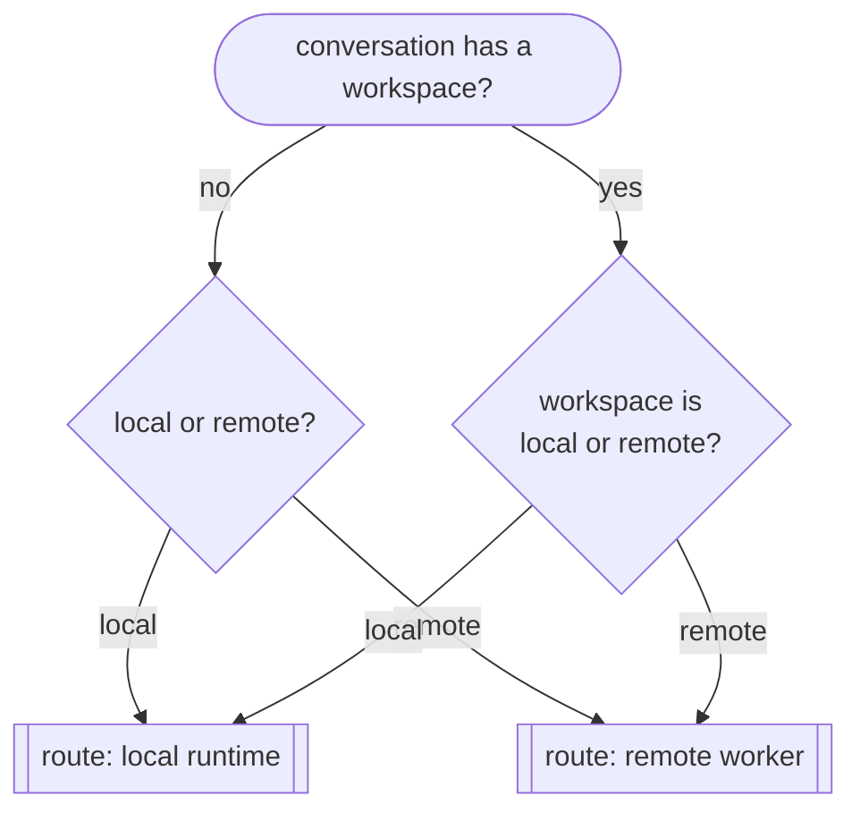

# 02 — Router: local vs remote

**Status:** `[~]` decision model settled; per-conversation routing persisted, remote/worker execution not wired yet
**Owns:** the local/remote routing decision
**Depends on:** [`../03-workspace-model/workspace.md`](../03-workspace-model/workspace.md), [`../05-execution-router-and-targets/runtime-targets.md`](../05-execution-router-and-targets/runtime-targets.md)

## Problem

A workspace can run on the local machine or on a remote host. The router decides, **per conversation** (and ultimately per task), where the agent executes — and keeps the conversation/agent state coherent when that changes.

## Decision model



- **Local**: the workspace runs as a local process (current `goble-app` + `goble-desktop-service` won't change); the harness runs in-process or as a local worker.
- **Remote**: the workspace runs on a remote host. The local app becomes a client that streams events from the remote harness and renders them "as if local". The conversation is **routed remote** and no longer routed locally.

## What makes routing safe

- **One workspace identity.** Local and remote are two *deployments* of the same workspace, so the agent, its config (TOML), secrets and ongoing state have one logical identity even when the deployment moves.
- **State is keyed by the workspace + agent + conversation**, not by the machine. Moving the deployment does not orphan the conversation.
- **The harness is the same** either way (reused from grok-build); only the *transport* differs (in-process/local vs WebSocket/mTLS to a worker).

## Router output

The router produces a **routing decision** for the execution layer:

```rust
enum Routing {
    Local,
    Remote { worker_id: WorkerId, address: String },
}

// consumed by ../05-execution-router-and-targets/execution-router.md
```

## Gaps vs current code

- `DesktopState::resolve_worker_for_target` already picks a worker (`target_kind` = `worker`), but returns an error for `local` ("local runtime target is not supported yet"). The router must make `local` a first-class target.
- There is no explicit routing-decision type or a "this conversation is routed to X" record yet.

## Tasks

- [x] Define the `Routing` decision type and attach it to a conversation — `WorkspaceRouting{Local,Remote}` in `app/src/ui`, persisted per conversation on the `chats.workspace_routing` column and restored on load.
- [~] Make `local` a valid runtime target — chat turns run on the local harness for `local`/unset routing; the `resolve_worker_for_target` `bail!` for the agent/workflow deploy path is still pending a local agent runner.
- [x] Persist the routing choice so a conversation stays stable across restarts (store column + `set/get_chat_workspace_routing` + `on_choose_workspace` + `refresh_messages` restore).
