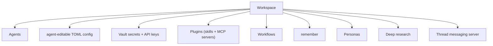

# 03 — Workspace model

**Status:** `[~]` shape agreed; single-workspace implementation pending
**Owns:** the **workspace** as the unit of deployment — what it contains and how it's addressed.
**Depends on:** [`../01-vision/README.md`](../01-vision/README.md)

## What a workspace is

A workspace is the unit of **deployment**. It packages everything an agent needs to run in one place, and it is addressed as a whole — so the router/execution layer can move it between local and a remote host without breaking the agents inside it.

## Boundaries

- **Now:** one workspace per deployment (local **or** remote). Multi-workspace is deferred — see [`../01-vision/boundaries-and-deferred.md`](../01-vision/boundaries-and-deferred.md).
- **A worker is a workspace.** When the local machine becomes a worker (Tailscale) or a remote host runs the goblin worker, that worker hosts agents + crons + secrets + the thread-messaging server — the same packaging.
- The **TOML is the agent-visible config**; **secrets live in the vault, referenced by id**, never in the TOML.

## Docs

- [`workspace.md`](workspace.md) — workspace as an addressable unit; local vs remote; worker-as-workspace.
- [`shared-secrets-and-toml.md`](shared-secrets-and-toml.md) — vault + API keys + the agent-editable TOML.
- [`multiple-agents.md`](multiple-agents.md) — many agents per workspace; shared config, per-agent CWD.

## Related

- [`../04-agent-runtime/README.md`](../04-agent-runtime/README.md) — the harness that runs inside a workspace.
- [`../05-execution-router-and-targets/README.md`](../05-execution-router-and-targets/README.md) — where the workspace actually runs.
