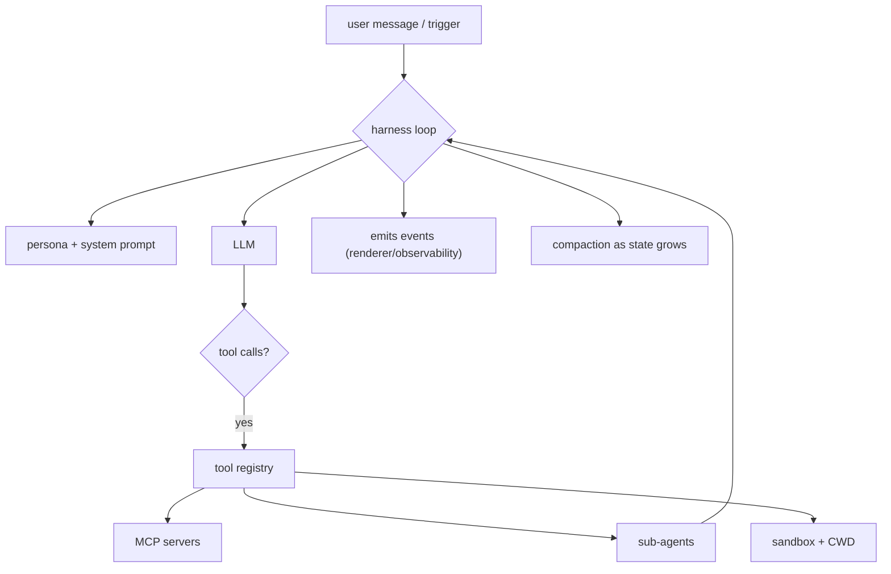

# 04 — Agent runtime (harness)

**Status:** `[~]` partial: `goble-core::harness` has `run_turn`; `DesktopState::run_chat_turn` drives the harness loop on the chat send path (tool calls execute + persist, assistant deltas stream into one message row so the renderer shows the reply progressively); reasoning and compaction are pending; reuse map to grok-build is the target
**Owns:** the agent execution engine — persona/state, tools, sub-agents, MCP, LLM, sandbox/CWD, memory.
**Depends on:** [`../03-workspace-model/README.md`](../03-workspace-model/README.md), [`../05-execution-router-and-targets/README.md`](../05-execution-router-and-targets/README.md)

## What the harness does

It is the loop that turns user intent into executed work: resolve a model, assemble the system prompt from the agent's persona, run tools/MCP, spawn sub-agents, keep the conversation state, compact it as it grows, and emit events for the renderer.

**Principle: our renderer, their harness.** Execution logic (tools, sandbox, sub-agents, sampler, MCP, compaction) is taken from the modular, highest-standard harness in `~/Projects/grok-build` (`xai-*` crates). The **UI design, custom render and rich-input** come from `~/Projects/warp-new` (see [`../06-renderer/README.md`](../06-renderer/README.md)) — and we build the renderer on `goble-ui`/`goble-ui-hot`, not a library.

## Subsystems

- [`agent-state-and-compaction.md`](agent-state-and-compaction.md) — persona, long-lived state, compaction to infinity.
- [`subagents.md`](subagents.md) — routine sub-agents that don't block the main chat.
- [`tools.md`](tools.md) — the tool registry and skills.
- [`mcp.md`](mcp.md) — dynamic MCP search/download/install.
- [`llm-and-models.md`](llm-and-models.md) — provider/model resolution and the sampling loop.
- [`inter-agent-communication.md`](inter-agent-communication.md) — agents talking within a workspace.
- [`sandbox-and-cwd.md`](sandbox-and-cwd.md) — per-agent CWD, isolation.
- [`memory.md`](memory.md) — `remember`.
- [`personas.md`](personas.md) — personae.
- [`deep-research.md`](deep-research.md) — long-running research.

## Reuse strategy

[`harness-reuse-map.md`](harness-reuse-map.md) maps each grok-build `xai-*` crate to the Goble subsystem that reuses it (or to a port-into-`goble-core` candid). This is the reference for what we take vs build.

## Related

- [`../07-observability/README.md`](../07-observability/README.md) — the events the harness emits.
- [`../05-execution-router-and-targets/execution-router.md`](../05-execution-router-and-targets/execution-router.md) — where the harness runs (local/remote).
