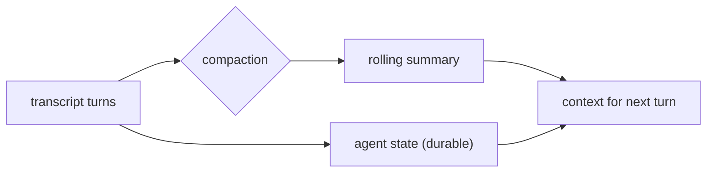

# 04 — Agent state & compaction

**Status:** `[~]` concept agreed; not implemented
**Owns:** the agent's long-lived "person" state and transcript compaction
**Depends on:** [`README.md`](README.md), [`../03-workspace-model/multiple-agents.md`](../03-workspace-model/multiple-agents.md)

## Problem

An agent is a **person you keep talking to**, not a stateless function. It must accumulate state across a session, keep it across restarts, and not blow up the context window as the conversation grows — the conversation "compacts to infinity".

## Model

Two layers:

1. **Conversation transcript** — the message history. Grows, then **compacts**: older turns are summarized/rolled up into a durable summary (see reuse of `xai-grok-compaction` / `xai-compaction-transcript` in [`harness-reuse-map.md`](harness-reuse-map.md)).
2. **Agent state** — the durable memory of what the agent "knows" and is doing: goals, preferences, decisions, task progress, and the persona's stable attributes. This outlives individual transcripts.

## Rules

- **Compaction is lossy-but-faithful.** Summaries must preserve decisions, open tasks, constraints and the persona voice; they may drop verbatim detail.
- **Compaction is triggered by size**, not time, so a long single turn doesn't break the context window.
- **State is keyed by agent id** (workspace-scoped), not by machine, so it survives local↔remote routing (see [`../02-first-run-and-routing/router-local-vs-remote.md`](../02-first-run-and-routing/router-local-vs-remote.md)).

## Gaps vs current code

- `goble-core::agent_memory` has `compaction`, `context`, `memory` modules — a starting point. Confirm they key state per-agent and persist across restarts.
- The renderer must display a "compacted" marker so the user knows older turns were rolled up (see [`../06-renderer/renderer-architecture.md`](../06-renderer/renderer-architecture.md)).

## Tasks

- [ ] Define agent **state** (durable) vs **transcript** (compacting) boundaries.
- [ ] Wire compaction triggers by token/size budget; persist the rolling summary.
- [ ] Key state by `agent_id` and make it survive local↔remote routing.
