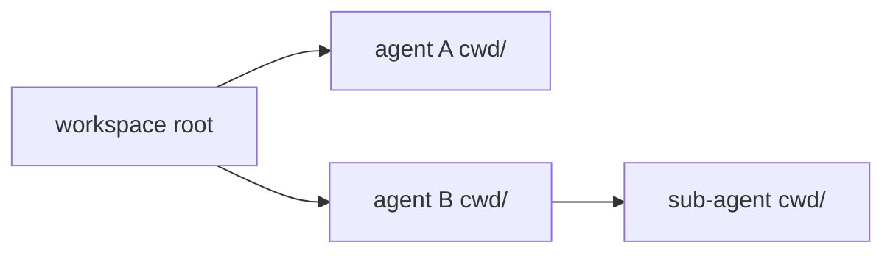

# 04 — Sandbox & per-agent CWD

**Status:** `[~]` partial: goblin-worker isolation exists; per-agent CWD + stronger sandbox pending
**Owns:** the working directory and isolation model for each agent + sub-agent
**Depends on:** [`README.md`](README.md), [`../03-workspace-model/workspace.md`](../03-workspace-model/workspace.md)

## Problem

Each agent gets its **own CWD** (a subdirectory of the workspace root) so agents don't step on each other, and execution must be **isolated** so a dangerous command or a leaked credential can't escape the workspace.

## CWD model

- Device/workspace **root** is the top; each agent has a **subdirectory**; sub-agents get a subdir under their parent.
- **The workspace root is not a hidden dot-folder.** For a user's own agents it lives somewhere the user controls (e.g. `Documents`) — or the user **chooses the location at create-time from a rich-input chip**, the same interaction warp-new uses for host/directory selection. Default user-visible location, not a hidden repo dir.
- Tools (shell, file, git) run relative to the agent's CWD.
- The sandbox permits access to the workspace root (+ deliberately shared paths), denies the rest.

## Isolation (reuse)

- `goble-core::isolate` + `goblin-worker`'s isolation runtime are the current baseline.
- Stronger OS-level sandboxing comes from `xai-grok-sandbox` (Landlock on Linux / Seatbelt on macOS) — see [`harness-reuse-map.md`](harness-reuse-map.md).

## Boundaries

- Secrets are injected into the harness **in-memory**; the sandbox controls filesystem/network, not the vault (see [`../03-workspace-model/shared-secrets-and-toml.md`](../03-workspace-model/shared-secrets-and-toml.md)).
- On a **remote** workspace the sandbox runs on the remote host; the local app only receives streamed events + terminal output (see [`../06-renderer/remote-terminal-renderer.md`](../06-renderer/remote-terminal-renderer.md)).

## Tasks

- [ ] Give each agent + sub-agent a CWD subdir under the workspace root.
- [ ] Tighten isolation (filesystem/network policy) per workspace, reusing `xai-grok-sandbox` where portable.
- [ ] Stream remote terminal output to the local renderer.
