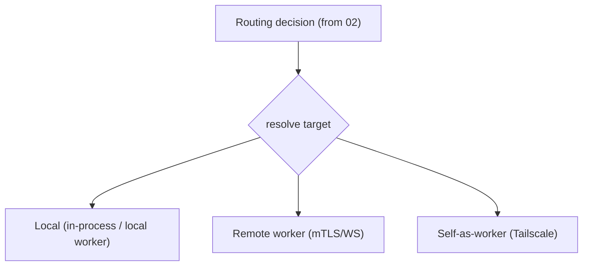

# 05 — Execution router & runtime targets

**Status:** `[~]` partial: `resolve_worker_for_target` exists; `local` target + promotion pending
**Owns:** translating a routing decision into a concrete place where a task runs, and the set of those places.
**Depends on:** [`../02-first-run-and-routing/router-local-vs-remote.md`](../02-first-run-and-routing/router-local-vs-remote.md), [`../04-agent-runtime/README.md`](../04-agent-runtime/README.md)

## What this does

The client-side arrow that decides *where* the harness executes. It consumes the routing decision from `02` and resolves it to one of a small set of **runtime targets**. It also manages promotion (local → remote) without interrupting a running conversation.

## Docs

- [`runtime-targets.md`](runtime-targets.md) — the set of targets and how each is addressed/connected.
- [`execution-router.md`](execution-router.md) — the resolution logic + promotion.

## Existing code this builds on

- `goble-desktop-service::DesktopState::resolve_worker_for_target(target_kind, tag, worker_id)` + `WorkerPool` (RoundRobin / TaggedFirst).
- `WorkerClient::connect` + mTLS (worker bundle) in `goble-desktop-service`.
- `send_to_worker` / `handle_worker_message` for remote event streaming.

## Tasks (summary; see leaf docs)

- [ ] Make `local` a supported target (currently `bail!("local runtime target is not supported yet")`).
- [ ] Resolve the routing decision → concrete target with connection params.
- [ ] Add self-as-worker (Tailscale) target and the mobile-facing endpoint.
