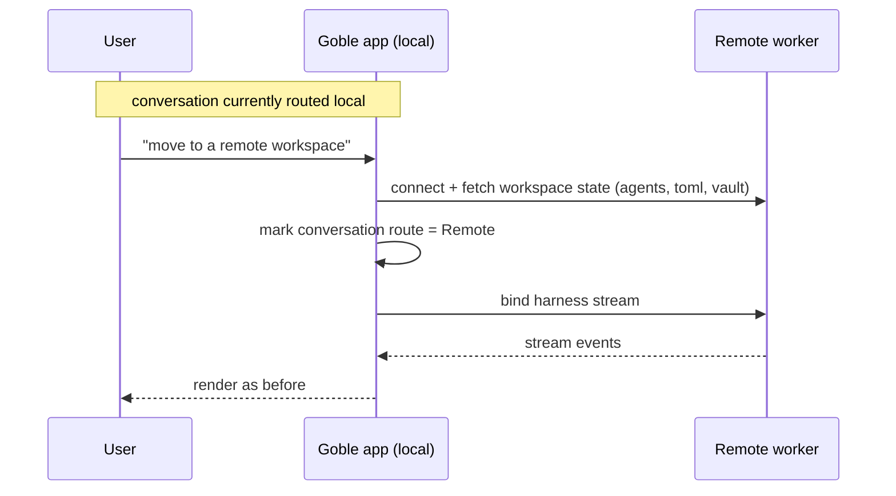

# 05 — Execution router

**Status:** `[~]` partial
**Owns:** turning a routing decision into a resolved target, and promotion local↔remote
**Depends on:** [`runtime-targets.md`](runtime-targets.md), [`../02-first-run-and-routing/router-local-vs-remote.md`](../02-first-run-and-routing/router-local-vs-remote.md)

## Problem

The UI delivers a *decision* ("this conversation runs remote"). The execution layer must turn that into a concrete `RuntimeTarget` it can bind to, and it must support moving a live conversation from local to remote without losing its state.

## Resolution

```rust
fn resolve(decision: Routing, workspace: &Workspace) -> Result<RuntimeTarget> {
    match decision {
        Routing::Local   => Ok(RuntimeTarget::Local),
        // choose a paired worker via WorkerPool (round-robin / tag-first)
        Routing::Remote { worker_id, .. } =>
            Ok(RuntimeTarget::Worker { worker_id }),
    }
}
```

- If the requested worker is **not paired**, the resolution fails with a clear error (no silent fallback).
- The resolved target is cached per conversation so repeated sends don't re-resolve mid-stream.

## Promotion (local → remote)



- State is keyed by **conversation + agent id**, not the machine, so the handoff doesn't reset the conversation.
- The vault/secret value must be present on the remote host; if not, the flow prompts to ship it (see [`../02-first-run-and-routing/remote-bootstrap.md`](../02-first-run-and-routing/remote-bootstrap.md)).

## Tasks

- [ ] Implement `resolve()`, honoring worker-pairing status.
- [ ] Cache the resolved target per conversation.
- [ ] Implement local→remote promotion, preserving agent+conversation state.
