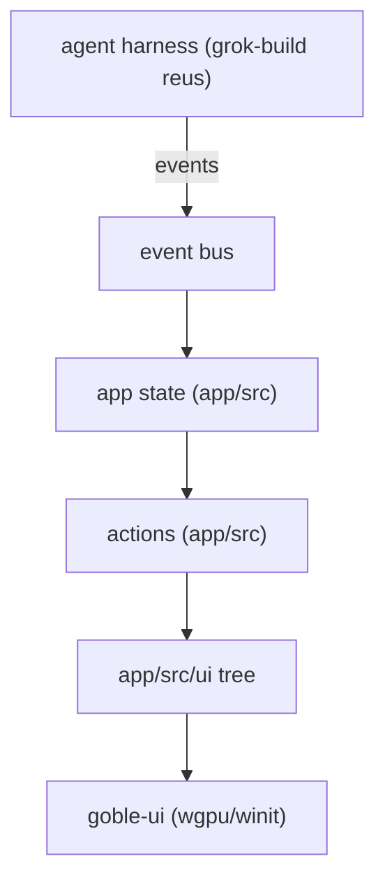

# 06 — Renderer (custom wgpu/Rust chat)

**Status:** `[x]` working (goble-ui + goble-app); hardening + remote capture pending
**Owns:** the from-scratch chat/UI renderer. No UI libraries.
**Depends on:** [`../04-agent-runtime/README.md`](../04-agent-runtime/README.md), [`../10-platform-and-performance/README.md`](../10-platform-and-performance/README.md)

## What this is

The renderer is ours and built from scratch on `wgpu` + `winit` in Rust. It is the product shell: sidebar, chat view, composer, settings, connectors/vault panels, crons. It is **not** the harness — the harness (from grok-build) runs behind it and emits events this renderer consumes.

## Layers

| Layer | Crate | Role |
| --- | --- | --- |
| Base UI/rendering | `goble-ui` | elements, layout, paint, wgpu/winit platform, theme, text atlas |
| UI tree | `app/src/ui` | the in-app element tree (`build_ui`) + snapshot/action types |
| App shell | `app/` (`goble-app`) | state + actions + `RootView` + runtime orchestration (`crate::runtime`) |
| Backend | `goble-desktop-service` | `DesktopState` (the real data/actions) |

## Design direction

The **look and interaction** come from `~/Projects/warp-new` (a sibling Rust project), not from scratch:

- **Design system / tokens** — `warp-new/app/src/themes/` (theme + palette model).
- **Icon / asset set** — `warp-new/app/assets/bundled/svg/` (the icon set the `goble-ui` `IconAtlas` bakes).
- **Rich input & remote-session interaction** — the chip-based input (host/directory/session badges above the composer) from warp-new; see [`remote-terminal-renderer.md`](remote-terminal-renderer.md).
- **Reference from-scratch Rust renderer** — `warp-new/crates/octomusui` (fonts / platform / rendering / windowing). We build a similar layer as `goble-ui`, and reuse the *direction* not the code.

## Docs

- [`renderer-architecture.md`](renderer-architecture.md) — the layered architecture and how state/actions/events flow.
- [`form-components.md`](form-components.md) — overlay/backdrop form widgets, incl. the API-endpoint connector form.
- [`remote-terminal-renderer.md`](remote-terminal-renderer.md) — taking over a remote host's terminal so our renderer shows remote output.
- `ui-spec/` — the migrated UI design specs (design tokens, shell layout, chat view, sidebar, topbar, testing checklist) that were previously flat at `.agents/` root: see [`ui-spec/00-readme.md`](ui-spec/00-readme.md).

## Related

- [`../07-observability/README.md`](../07-observability/README.md) — the streams the renderer shows (executions, traces, logs).
- [`../10-platform-and-performance/README.md`](../10-platform-and-performance/README.md) — the wgpu/winit platform layer + perf budget.
