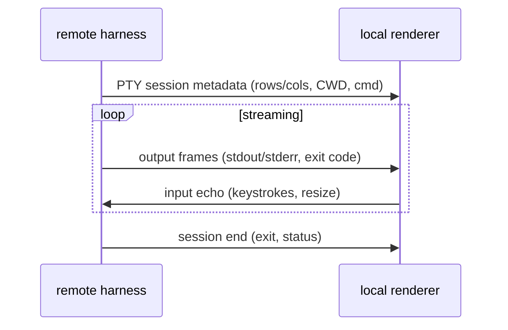

# 06 — Remote terminal renderer

**Status:** `[ ]` not started
**Owns:** showing a **remote host's** terminal output through our own renderer
**Depends on:** [`README.md`](README.md), [`../05-execution-router-and-targets/runtime-targets.md`](../05-execution-router-and-targets/runtime-targets.md)

## Problem

When a workspace runs **remote**, the harness runs on the remote host but the user is on the local app. The terminal output (shell commands `cargo test`, build logs, etc.) is produced **there**. We want to "take over that terminal" and render it with our custom renderer, so the user sees the same rich output as a local run.

## UX from warp-new (the "chip" pattern)

`~/Projects/warp-new` handles remote SSH sessions really well: when you connect to a host, a **chip** appears (e.g. `root@99...`) above the input, and the **chat continues normally, as if it were local**. We reuse that interaction:

- A **session chip** sits above the composer/chat, showing which host the conversation is bound to (`root@…` / `worker:…`).
- Everything below the chip renders exactly like a local conversation — the remote nature is a *badge*, not a different layout.
- The chip is clickable to disconnect / switch target.

This keeps one mental model (the chat is the surface) regardless of where the work actually runs.

## Model

- Reuse the PTY/session machinery from grok-build (`xai-grok-shell-*`, `xai-grok-pager-pty-harness`, `ptyctl`) — see [`../04-agent-runtime/harness-reuse-map.md`](../04-agent-runtime/harness-reuse-map.md).
- The renderer consumes the same event stream it handles for local runs, so visuals are identical (a "terminal block" in chat, syntax tinting, exit status).

## Boundaries & risk

- **Capabilities differ.** Not every remote host can run our wgpu renderer (headless VPS). Two options:
  1. *Terminal capture* — stream raw PTY output back, render locally in a terminal card (safe, works everywhere).
  2. *Renderer-on-remote* — ship the renderer to the host and stream frames back (heavier; only where a display/GPU or headless swapchain exists).
- Input/resize round-trips must be bounded and non-blocking so a laggy link doesn't freeze the chat.

## Tasks

- [ ] Define the remote terminal session + stream protocol (metadata, frames, input, resize).
- [ ] Render the **session chip** (host badge) above the composer, per warp-new.
- [ ] Render remote PTY output in the local chat (terminal card).
- [ ] (Later) optional renderer-on-remote frame streaming.
