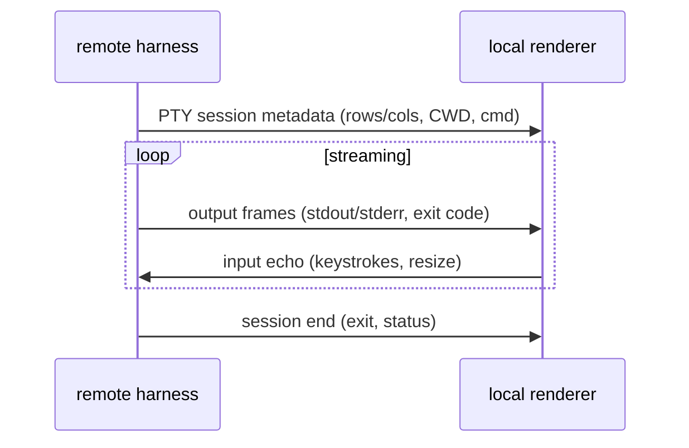

# 06 — Remote terminal renderer

**Status:** `[ ]` not started
**Owns:** showing a **remote host's** terminal output through our own renderer
**Depends on:** [`README.md`](README.md), [`../05-execution-router-and-targets/runtime-targets.md`](../05-execution-router-and-targets/runtime-targets.md)

## Problem

When a workspace runs **remote**, the harness runs on the remote host but the user is on the local app. The terminal output (shell commands `cargo test`, build logs, etc.) is produced **there**. We want to "take over that terminal" and render it with our custom renderer, so the user sees the same rich output as a local run.

## UX from warp-new (the "chip" pattern)

`~/Projects/warp-new` handles remote SSH sessions really well: when you connect to a host, a **chip** appears (e.g. `root@99...`) above the input, and the **chat continues normally, as if it were local**. We reuse that interaction:

- A **session chip** sits above the composer/chat, showing which host the conversation is bound to (`root@…` / `worker:…`).
- Everything below the chip renders exactly like a local conversation — the remote nature is a *badge*, not a different layout.
- The chip is clickable to disconnect / switch target.

This keeps one mental model (the chat is the surface) regardless of where the work actually runs.

## Model

- Reuse the PTY/session machinery from grok-build (`xai-grok-shell-*`, `xai-grok-pager-pty-harness`, `ptyctl`) — see [`../04-agent-runtime/harness-reuse-map.md`](../04-agent-runtime/harness-reuse-map.md).
- The renderer consumes the same event stream it handles for local runs, so visuals are identical (a "terminal block" in chat, syntax tinting, exit status).

## Boundaries & risk

- **Capabilities differ.** Not every remote host can run our wgpu renderer (headless VPS). Two options:
  1. *Terminal capture* — stream raw PTY output back, render locally in a terminal card (safe, works everywhere).
  2. *Renderer-on-remote* — ship the renderer to the host and stream frames back (heavier; only where a display/GPU or headless swapchain exists).
- Input/resize round-trips must be bounded and non-blocking so a laggy link doesn't freeze the chat.

## Transport: SSH versus our mTLS — verified against the reference

Open question that prompted this section: *warp-new uses SSH for remote sessions, we use mTLS over
WebSocket — should we switch to SSH?* The reference was read to answer it. Citations are relative to
`~/Projects/warp-new`.

**What warp-new actually does: SSH, and only SSH.**

- The only `RemoteTransport` implementation is the SSH one (`app/src/remote_server/ssh_transport.rs:103`).
- It shells out to the **system `ssh` binary** (`ssh_transport.rs:227-231`) and multiplexes over an
  OpenSSH **ControlMaster** socket created by its shell wrapper
  (`app/assets/bundled/bootstrap/bash_body.sh:988-989`). No SSH library is linked at all — no `russh`,
  `thrussh`, `openssh`, `ssh2`.
- **There is no mTLS anywhere in the remote path.** A repo-wide search for `mtls`, `client_cert`,
  certificate pinning returns nothing in application code. `rustls` appears only for outbound cloud
  HTTP/WebSocket (`app/src/lib.rs:830-836`, `crates/websocket/Cargo.toml:34-44`).
- The remote daemon **authenticates nobody at the crypto layer**: it reads a Unix socket whose trust
  boundary is filesystem permissions (`0700` dir, `0600` socket — `app/src/remote_server/unix/proxy.rs:87-91`).
  Confidentiality comes entirely from the user's own SSH connection.

**Why that is legitimate for Warp and wrong for us.** Warp's product *is* an SSH terminal: the user
runs `ssh host` themselves, so identity, `known_hosts`, agent forwarding, `ProxyCommand`, jump hosts
and bastions are all inherited for free (`bash_body.sh:988`). Their own specs record the cost: the
feature is **disabled on Windows** because ControlMaster does not exist there
(`crates/octomus_features/src/lib.rs:973-976`), and a new host cannot be provisioned without an
interactive login first.

Our worker is a service on a machine the user may never have logged into. Adopting SSH as the only
transport would push us into `authorized_keys` distribution, key rotation, and reachability problems
that mTLS-over-WebSocket avoids — and would *lose* something: warp-new has no cryptographic client
identity to its worker, while our mTLS gives mutual, revocable, role-checked identity
(`crates/goble-core/src/identity.rs:401-441`).

**Decision: keep mTLS over WebSocket.** Copy the properties SSH gives them, not the mechanism.

### What to copy anyway (transport-independent, and they are the load-bearing parts)

1. **Long-lived server separate from per-session connections.** Their proxy/daemon split
   (`specs/APP-4068/TECH.md:30-98`) survives disconnects, shares state across tabs, and makes
   reconnect cheap; the daemon is `setsid`-detached and lingers 10 minutes after the last client
   (`app/src/remote_server/server_model.rs:61-62`).
2. **A transport trait as the seam** (`crates/remote_server/src/transport.rs:190`) so an SSH backend
   can be added later without touching session logic.
3. **Bounded reconnect with an explicit state machine** and a clear unrecoverable signal. Note their
   own version is weak — 2 attempts at a fixed 2 s, exit 255 unrecoverable
   (`crates/remote_server/src/manager.rs:46-50`, `ssh_transport.rs:281-292`) — and their spec lists
   backoff and a reconnect indicator as still-open follow-ups (`specs/APP-4283/TECH.md:116-121`).
4. **Version negotiation at handshake**, forcing reinstall on mismatch rather than running skewed
   (`manager.rs:228-256`).
5. **Length-prefixed framing with a hard max size checked before allocation**
   (`crates/remote_server/src/protocol.rs:8-13`), and **request-ID correlation with per-request
   timeouts** (`crates/remote_server/src/client/mod.rs:752-800`). This is the part custom protocols
   usually get wrong.
6. **Install path shape**: probe the platform, download on the remote with a client-upload fallback
   when it has no curl/wget (`setup.rs:534-573`, `:629`).

## Known defects to fix while wiring this

Found during the transport read of our own tree (all verifiable in `app/` and `crates/`):

- `POST /pair` stores whatever hash is supplied and always answers `paired: true`
  (`crates/goblin-worker/src/pairing.rs:20-40`) — pairing is not actually verified.
- The Helm chart mounts the TLS bundle but never sets `GOBLIN_TLS_BUNDLE`
  (`deploy/goblin/charts/goblin-cluster/templates/statefulset.yaml:99-109`; the worker only enables
  TLS when that variable is present, `crates/goblin-worker/src/main.rs:44-46`), so a chart-deployed
  worker starts plaintext. `scripts/install-goblin.sh:36-37` has no TLS at all.
- The PTY is hard-coded to 24×96 (`app/src/terminal.rs:509-514`) and `set_size` has no caller
  (`:583-592`), so every program we run sees the wrong dimensions.
- The app itself never uses the remote path: `DaemonModel.remote` is always `None` and remote turns
  error by design (`app/src/daemon/state.rs:49-59`, `:108-115`).

## Tasks

- [ ] Fix the `POST /pair` hash check and set the pairing hash at provision time.
- [ ] Set `GOBLIN_TLS_BUNDLE` in the Helm chart and `install-goblin.sh` so deployed workers are mTLS.
- [ ] Wire `TerminalSession::set_size` to the pane size.
- [ ] Define the remote terminal session + stream protocol (metadata, frames, input, resize).
- [ ] Render the **session chip** (host badge) above the composer, per warp-new.
- [ ] Render remote PTY output in the local chat (terminal card).
- [ ] Add a `RemoteTransport`-style trait + bounded reconnect with backoff before adding SSH support.
- [ ] (Later) optional SSH backend behind that trait, and optional renderer-on-remote frame streaming.
