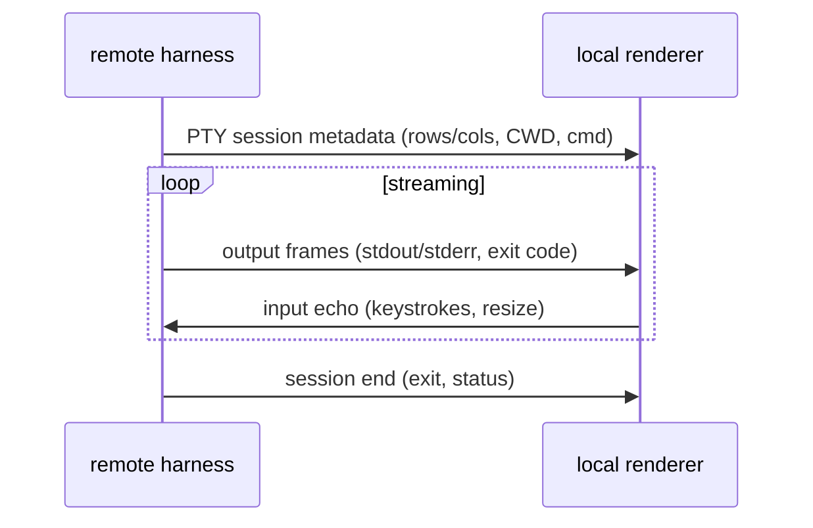

# 06 — Remote terminal renderer

**Status:** `[ ]` not started
**Owns:** showing a **remote host's** terminal output through our own renderer
**Depends on:** [`README.md`](README.md), [`../05-execution-router-and-targets/runtime-targets.md`](../05-execution-router-and-targets/runtime-targets.md)

## Problem

When a workspace runs **remote**, the harness runs on the remote host but the user is on the local app. The terminal output (shell commands `cargo test`, build logs, etc.) is produced **there**. We want to "take over that terminal" and render it with our custom renderer, so the user sees the same rich output as a local run.

## UX from warp-new (the "chip" pattern)

`~/Projects/warp-new` handles remote SSH sessions really well: when you connect to a host, a **chip** appears (e.g. `root@99...`) above the input, and the **chat continues normally, as if it were local**. We reuse that interaction:

- A **session chip** sits above the composer/chat, showing which host the conversation is bound to (`root@…` / `worker:…`).
- Everything below the chip renders exactly like a local conversation — the remote nature is a *badge*, not a different layout.
- The chip is clickable to disconnect / switch target.

This keeps one mental model (the chat is the surface) regardless of where the work actually runs.

## Model

- Reuse the PTY/session machinery from grok-build (`xai-grok-shell-*`, `xai-grok-pager-pty-harness`, `ptyctl`) — see [`../04-agent-runtime/harness-reuse-map.md`](../04-agent-runtime/harness-reuse-map.md).
- The renderer consumes the same event stream it handles for local runs, so visuals are identical (a "terminal block" in chat, syntax tinting, exit status).

## Boundaries & risk

- **Capabilities differ.** Not every remote host can run our wgpu renderer (headless VPS). Two options:
  1. *Terminal capture* — stream raw PTY output back, render locally in a terminal card (safe, works everywhere).
  2. *Renderer-on-remote* — ship the renderer to the host and stream frames back (heavier; only where a display/GPU or headless swapchain exists).
- Input/resize round-trips must be bounded and non-blocking so a laggy link doesn't freeze the chat.

## Transport: SSH versus our mTLS — verified against the reference

Open question that prompted this section: *warp-new uses SSH for remote sessions, we use mTLS over
WebSocket — should we switch to SSH?* The reference was read to answer it. Citations are relative to
`~/Projects/warp-new`.

**What warp-new actually does: SSH, and only SSH.**

- The only `RemoteTransport` implementation is the SSH one (`app/src/remote_server/ssh_transport.rs:103`).
- It shells out to the **system `ssh` binary** (`ssh_transport.rs:227-231`) and multiplexes over an
  OpenSSH **ControlMaster** socket created by its shell wrapper
  (`app/assets/bundled/bootstrap/bash_body.sh:988-989`). No SSH library is linked at all — no `russh`,
  `thrussh`, `openssh`, `ssh2`.
- **There is no mTLS anywhere in the remote path.** A repo-wide search for `mtls`, `client_cert`,
  certificate pinning returns nothing in application code. `rustls` appears only for outbound cloud
  HTTP/WebSocket (`app/src/lib.rs:830-836`, `crates/websocket/Cargo.toml:34-44`).
- The remote daemon **authenticates nobody at the crypto layer**: it reads a Unix socket whose trust
  boundary is filesystem permissions (`0700` dir, `0600` socket — `app/src/remote_server/unix/proxy.rs:87-91`).
  Confidentiality comes entirely from the user's own SSH connection.

**Why that is legitimate for Warp and wrong for us.** Warp's product *is* an SSH terminal: the user
runs `ssh host` themselves, so identity, `known_hosts`, agent forwarding, `ProxyCommand`, jump hosts
and bastions are all inherited for free (`bash_body.sh:988`). Their own specs record the cost: the
feature is **disabled on Windows** because ControlMaster does not exist there
(`crates/octomus_features/src/lib.rs:973-976`), and a new host cannot be provisioned without an
interactive login first.

Our worker is a service on a machine the user may never have logged into. Adopting SSH as the only
transport would push us into `authorized_keys` distribution, key rotation, and reachability problems
that mTLS-over-WebSocket avoids — and would *lose* something: warp-new has no cryptographic client
identity to its worker, while our mTLS gives mutual, revocable, role-checked identity
(`crates/goble-core/src/identity.rs:401-441`).

**Decision: keep mTLS over WebSocket.** Copy the properties SSH gives them, not the mechanism.

### What to copy anyway (transport-independent, and they are the load-bearing parts)

1. **Long-lived server separate from per-session connections.** Their proxy/daemon split
   (`specs/APP-4068/TECH.md:30-98`) survives disconnects, shares state across tabs, and makes
   reconnect cheap; the daemon is `setsid`-detached and lingers 10 minutes after the last client
   (`app/src/remote_server/server_model.rs:61-62`).
2. **A transport trait as the seam** (`crates/remote_server/src/transport.rs:190`) so an SSH backend
   can be added later without touching session logic.
3. **Bounded reconnect with an explicit state machine** and a clear unrecoverable signal. Note their
   own version is weak — 2 attempts at a fixed 2 s, exit 255 unrecoverable
   (`crates/remote_server/src/manager.rs:46-50`, `ssh_transport.rs:281-292`) — and their spec lists
   backoff and a reconnect indicator as still-open follow-ups (`specs/APP-4283/TECH.md:116-121`).
4. **Version negotiation at handshake**, forcing reinstall on mismatch rather than running skewed
   (`manager.rs:228-256`).
5. **Length-prefixed framing with a hard max size checked before allocation**
   (`crates/remote_server/src/protocol.rs:8-13`), and **request-ID correlation with per-request
   timeouts** (`crates/remote_server/src/client/mod.rs:752-800`). This is the part custom protocols
   usually get wrong.
6. **Install path shape**: probe the platform, download on the remote with a client-upload fallback
   when it has no curl/wget (`setup.rs:534-573`, `:629`).

## Two remote directions, and they are not the same feature

The user's own `ssh` session and our worker are two different things, and the client treats them differently. Warp-new has both, and its two halves behave as described below; the split is what we copy.

| | **A. The user's own SSH session** | **B. A session on our worker** |
| --- | --- | --- |
| Who opened the connection | the user typed `ssh host`; the system `ssh` binary runs in the local PTY | the app, to a paired worker, over mTLS/WebSocket ([`05 — runtime-targets.md`](../05-execution-router-and-targets/runtime-targets.md)) |
| Where the agent runs | **nowhere** in plain terminal mode: the pane is a terminal, with no agent attached | **on the host**, in the worker's own harness (`goblin` carries it — `goble-harness-*`, `goble-daemon`, `goble-workflow`) |
| What survives the local machine sleeping | nothing: the SSH connection dies with the laptop, and so does any agent that was running locally | the run: the worker keeps executing, and the client re-attaches when it wakes |
| Who chooses the environment/model | the user, in the shell | the user, at submit time — an environment (medium) and a model, passed through |

**A. Plain terminal, then agent on the same connection.** A shell pane on an SSH session starts as a terminal: no agent, no transcript, only what the shell prints. Pressing **`Cmd+Enter`** moves that pane into terminal + agent mode **without dropping the connection** — no reconnect, no second session, no replayed banner. This is warp-new's own model: its mode switch is an input mode on one live session (`SetInputModeAgent`), the PTY and the SSH connection are never restarted. The pane keeps whatever the shell already printed.

**The session must say where it is.** After the user submits `ssh <host>` in the rich input, the session is bound to that host and a chip above the composer names it (`user@host`, or the alias and its address), so a remote session is never mistaken for a local one. Warp-new reads the target by **parsing the `ssh` command line** (`INTERACTIVE_SSH`, plus the `gcloud`/`eb`/`doctl` variants) and renders it in the block prompt row — not from an OSC escape. We already read `~/.ssh/config` for the Settings page (`goble-core::ssh_hosts`), which is where an alias's real host and user come from.

**B. The agent lives remote.** This is the direction that is friendly to the user's machine: the conversation is a **viewer session** on the worker, with no local shell of its own, and it stays alive while the client is asleep or closed. Warp-new builds it as its own tab ("cloud agent"), not as a toggle on a terminal pane; the composer carries the environment and model selectors, and the credentials are resolved on the client and pushed to the worker ([`../03-workspace-model/shared-secrets-and-toml.md`](../03-workspace-model/shared-secrets-and-toml.md)).

### Which is which, in the code

- The **plain** path is the local PTY plus the system `ssh` binary. Nothing on the remote is ours, so nothing has to be installed for it to work — this is the path a user gets without provisioning anything.
- The **worker** path is the mTLS/WebSocket transport this document already decides to keep. Its install is `goblin` alone (`TRACKER.md` R74): the host gets our harness because the harness is inside the binary, and gets no language runtime, no container runtime and no third-party agent runtime.

## Known defects to fix while wiring this

Found during the transport read of our own tree (all verifiable in `app/` and `crates/`):

- `POST /pair` stores whatever hash is supplied and always answers `paired: true`
  (`crates/goblin-worker/src/pairing.rs:20-40`) — pairing is not actually verified.
- The Helm chart mounts the TLS bundle but never sets `GOBLIN_TLS_BUNDLE`
  (`deploy/goblin/charts/goblin-cluster/templates/statefulset.yaml:99-109`; the worker only enables
  TLS when that variable is present, `crates/goblin-worker/src/main.rs:44-46`), so a chart-deployed
  worker starts plaintext. `scripts/install-goblin.sh:36-37` has no TLS at all.
- The PTY is hard-coded to 24×96 (`app/src/terminal.rs:509-514`) and `set_size` has no caller
  (`:583-592`), so every program we run sees the wrong dimensions.
- The app itself never uses the remote path: `DaemonModel.remote` is always `None` and remote turns
  error by design (`app/src/daemon/state.rs:49-59`, `:108-115`).

## Tasks

- [ ] Fix the `POST /pair` hash check and set the pairing hash at provision time.
- [ ] Set `GOBLIN_TLS_BUNDLE` in the Helm chart and `install-goblin.sh` so deployed workers are mTLS.
- [ ] Wire `TerminalSession::set_size` to the pane size.
- [ ] Define the remote terminal session + stream protocol (metadata, frames, input, resize).
- [x] Parse the `ssh` command line in the rich input and bind the session to the host it names (alias resolved through `goble-core::ssh_hosts`, so `~/.ssh/config` supplies the real address).
- [x] Render the **session chip** (host badge) above the composer, per warp-new, naming the bound host; a local session carries no chip. **Done in S2:** the chip's words are the session's own (`SshSession::chip_label()` — `user@host`, or `user@alias (resolved address)` when an alias from `~/.ssh/config` was used), and the composer draws it flat, leading the context row above the editor, fed by the pane's bound session in `TerminalRegistry`. A local session draws nothing.
- [x] Let `Cmd+Enter` move a shell pane on an SSH session into terminal + agent mode **on the same session** (no reconnect, no second PTY), and back out again. **Done in S3:** one entry point in both directions, `open_pane_harness` (`app/src/actions/pane_ops.rs`), reached by the chord — the shell bar's Cmd+Enter on the way in and the agent view's Esc on the way out — and it only flips the pane's own mode (`PaneControls::harness_mode`), binds a conversation if the pane owns none and points the pane's view at it. Nothing touches the PTY: the session the pane was on is the session it stays on, and its history is the same block list. Two guards ride on that one entry point, both the reference's own errors. *Already in the agent view:* entering again pushes no second conversation, no second card and no second view — the reference's `AlreadyInAgentView` — and the case is real, because the tree a chord is dispatched into can be a frame old (a card click and the chord both land on the tree that drew the shell). *A command running in the pane's shell:* the switch is refused and says so — the reference's `LongRunningCommand` — drawing `Cannot enter agent mode while a command is running.` over the shell the pane stayed on (`PaneControls::harness_refusal` → `TerminalView::with_harness_refusal`, a full-width `SurfaceRaised` band with the reason in `Error`), and the reason is only read while the command that caused it is still running, so a stale line is never drawn over a shell that is back at a prompt. A pane bound to an SSH session is exempt from that guard (`TerminalRegistry::running_a_command`): the command its shell is running *is* the session — the local `ssh` process — while the remote shell is at a prompt, and refusing it would refuse exactly the pane the switch exists for. Evidence: `cargo test -p goble-app` → exit 0, `goble-app` lib **443 passed / 0 failed** (438 before; the 5 new cases), no `FAILED` line in any target. The cases: `ui::terminal::tests::cmd_enter_switches_an_ssh_bound_pane_to_the_agent_view_on_the_same_session` (over the real tree — the bound pane draws the chip and the output it already printed, `Cmd+Enter` puts the agent surface up with the binding, the history and the refusal slot all unchanged, and Esc brings the shell back with the chip, the history and the binding intact); `cmd_enter_on_a_pane_already_in_the_agent_view_pushes_nothing_again`; `a_command_running_in_the_panes_own_shell_refuses_the_switch_and_says_so`; `terminal::tests::ssh_session::the_pane_keeps_its_own_shell_process_across_the_switch` (a real PTY: the shell prints its own `$$`, and the same digits come back after the round trip through the switch — the same process, not a restarted pty or a second session — with the line it printed before the switch still on its screen); `terminal::tests::pane_commands::an_agent_command_is_refused_while_the_shell_is_inside_the_ssh_line`. **Not verified:** no host was reached — there is no peer here — so a real `ssh` connection was never made and no remote shell ever ran: the binding is the fixture `~/.ssh/config` alias or the state's own `set_ssh_session`, and what the agent can run once it is in that mode is the bullet below, not this one.
- [ ] Route the agent's `run_command` to a pane whose shell is on an SSH session. **Recorded by S3 as it stands today, not built** (the mode switch does not depend on it). The harness's shell tool reaches a terminal pane through the pane's own session — `UiState::pane_session` → `TerminalRegistry::pane_session` (`app/src/terminal/registry.rs`), handed to the turn in `app/src/runtime.rs` — and on a bound pane that route cannot answer, for three reasons that compound. (1) A claim attaches to the block that is waiting for a command (`Emulator::claim_active_block` → `BlockList::claim_next_pre_exec`), and a bound pane's active block is `Executing` for as long as the user is on the host, because the command being run is the local `ssh` process itself; the tool call therefore fails with the pane's own `the pane's shell is not ready to run an agent command` (`app/src/terminal/session/pump.rs`, `app/src/terminal/claim.rs`) and not a byte is written into the pty — this is what an agent's `run_command` gets on an SSH-backed pane today, and it is pinned by `terminal::tests::pane_commands::an_agent_command_is_refused_while_the_shell_is_inside_the_ssh_line`. (2) Even with a claim armed, the hooks that resolve it (`Preexec`/`CommandFinished`) come from the **local** shell's integration, and the local shell is not the one that would run the command — the remote shell has no integration — so the block would never finish and the call would end on `PANE_TOOL_TIMEOUT` (35 s) with `the pane did not answer within 35s`. (3) While the pane is in agent mode nothing pumps its session at all: `TerminalSession::pump` has exactly one production caller, `TerminalView::rebuild` (`app/src/ui/terminal/build.rs`), which agent mode never mounts — `build_terminal` returns `chat::build_agent_chat` — so a request would sit in the single `PaneCommands.request` slot until that same timeout, and a second submission is refused with `the pane is already running a command for the agent`. Which of the three a fix should take on is the open question; the reference's answer is that the agent drives the *remote* shell over the connection's own channel rather than through the local integration's hooks.
- [x] Keep a plain shell pane agent-free: a pane with no SSH session and no agent mode runs the user's shell and nothing else. **Done in S4:** the pane's content shape is read from the pane's own **mode** (`PaneControls::harness_mode`, the per-pane control app state holds and hands to every frame), never from the pane's kind and never from the conversation its block list is filtered to — `build_terminal` branches on that mode and builds the shell surface with `BlockView::Terminal`, so an SSH-bound pane in terminal mode is a terminal with a chip and no agent surface, and only `Cmd+Enter`'s switch mounts the agent view.
- [ ] Render remote PTY output in the local chat (terminal card).
- [ ] Add a `RemoteTransport`-style trait + bounded reconnect with backoff before adding SSH support.
- [ ] (Later) optional SSH backend behind that trait, and optional renderer-on-remote frame streaming.
