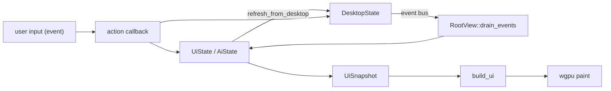

# 06 — Renderer architecture

**Status:** `[x]` core working
**Owns:** the data/state/actions/event flow in the renderer
**Depends on:** [`README.md`](README.md)

## Components

- **`goble-ui`** — the primitive layer: elements, layout (`warp::LayoutContext`-style), paint, geometry, color/theme, `platform/*` (winit window, wgpu render engine, text + icon atlas). Its design direction/tokens/icon assets come from `~/Projects/warp-new` (see [`README.md`](README.md)); `octomusui` in warp-new is the sibling reference for a from-scratch Rust renderer.
- **`app/src/ui`** — the in-app UI builder: owns `build_ui(...)` and the snapshot/action types (`UiSnapshot`, `UiActions`, `AiSnapshot`, `AiActions`, `AppTab`), plus the per-screen modules (`chat`, `sidebar`, `shell`, `crons`, `connectors`, `vault`, `model_form`). Built directly in the app crate — like warp-new builds its windows in `app` — so there is no hot-reload cdylib or ABI boundary.
- **`app/` (`goble-app`)** — the executable: owns `UiState`/`AiState`, the `make_actions`/`make_ai_actions` callbacks, `RootView`, and the runtime orchestration (`crate::runtime`) that decides where a turn runs (local harness today, remote pending). The element tree is rebuilt from state **every frame**; state is kept in the executable so text focus/value survive rebuilds.

## Data flow

## Input conventions

**The wheel.** A wheel event is `DispatchedEvent::Scroll { delta }`, converted once from winit in `platform/window.rs` (`LineDelta` × 20 px; `PixelDelta` divided by the zoomed scale) with no per-platform branch. winit's contract is that the delta says how far the **content** should move and that positive is right/down (`winit::event::MouseScrollDelta`), and all four backends already land on it: macOS passes AppKit's `scrollingDeltaY` through, so the OS's natural-scrolling setting decides the sign; X11 maps wheel-up to `LineDelta(0.0, 1.0)` and wheel-down to `-1.0`; Wayland negates its axis values to fit; Windows passes the signed `WM_MOUSEWHEEL` value through. A consumer therefore moves the content *by* the delta, which for a scrolling region means **subtracting** it: `Scrollable` calls `scroll_by(-delta)` (`crates/goble-ui/src/elements/scrollable.rs`) and `TerminalView::handle_wheel` reads a negative delta as the walk into the scrollback (`app/src/ui/terminal/input.rs`). The same sign is the normal direction on macOS, Windows and Linux, so this is deliberately not a `#[cfg]` per platform.

**The chord table.** The workspace's global chords are handled in `app/src/root_view/element.rs` before the tree is dispatched, so a focused composer cannot swallow them (⌘K palette, ⌘Space split right, ⌘⇧D split down, ⌘⇧T new terminal, ⌘⇧W tasks & workflows, ⌘W close pane, the ⌘+arrow pane moves, and Ctrl+. for the shortcuts panel); the composer's own gestures are the instruction strip's list (`app/src/ui/shortcut_hints.rs`) and the palette's keys are `app/src/ui/palette.rs`. `app/src/ui/shortcuts_help.rs` draws exactly that table — nothing more — as one row per gesture with the strip's key caps, and its test dispatches every row it names and checks the effect, so a row there is a binding here.

**What a split opens.** A pane leaf is one of three kinds (`app/src/ui/pane.rs`): `Chat` (the agent conversation surface), `Terminal` (a real pty, drawing its shell or — harness open — the very agent view a chat pane mounts) and `File { path }` (a read-only file view). ⌘Space and ⌘⇧D split into a **terminal** leaf whose harness is open (`open_pane_harness`, `app/src/actions/pane_ops.rs`), so the new pane starts as an agent *and* a terminal: Esc, and the pane header's `esc for terminal` chip, have a shell to return to, and ⌘⇧T remains the plain pty. A `Chat` leaf has no shell behind it, which is why a split must not create one: the pane would have no way back to terminal mode. A file view opens from the explorer tree or a search result on a plain click — the mouse events carry a position and a button and no modifiers (`DispatchedEvent::{MouseDown,MouseUp}`), so a ⌘-click variant is not expressible today — and it carries the file in its own leaf so a restored layout reopens it, keeping the pane's `file_scroll` offset.

**Hover, and the frame it needs.** Hover is decided at paint time from `PaintContext`'s cursor (`hovered`), never from element-local state, because the tree is rebuilt every frame. A surface that exists *only* while the pointer is over something therefore needs two things: the state that says what is hovered must be app-owned (`Rc<RefCell<_>>`, like the menus' open flags — `PopupMenu::with_hover_index` shares the row its tray belongs to), and a pointer move must request a frame of its own (`platform/window.rs`, `CursorMoved`), otherwise the surface waits for the 250 ms idle heartbeat. A tray built from that state is in the tree one frame after the pointer reaches its row; the frame between a press and its release must be painted with the pointer where it is, which is what `menu_flow`'s `click_with_pointer` reproduces. The same reason makes the tray's overflow rule best-effort: layout has no element position, so a menu the app rebuilds can only test the width it was given, and an unbounded one (a shrink-to-content row such as the topbar's) always opens its tray to the right.

## Backend wiring (what's real)

`make_actions`/`make_ai_actions` receive `Option<Arc<DesktopState>>`. When `Some` (production, via `DesktopState::open_default`), actions call the real methods — chats, cron/workflows, LLM settings, workers, vault, cluster, MCP connectors. When `None` (store couldn't open) they fall back to in-memory mock. See [`app/src/actions.rs`](../../app/src/actions.rs) and [`app/src/ai/actions.rs`](../../app/src/ai/actions.rs).

## Current gaps (vs target product)

- The **first-run flow is wired**: no-key banner (modal overlay) → Settings→LLM → local/remote choice → continue local, driven via `chat.rs` + `actions.rs` and covered by `app/src/integration_testing/first_run_flow.rs`. The routing choice persists per conversation on the `chats.workspace_routing` column and is restored on load.
- `on_send_message` drives the **harness** (`DesktopState::run_chat_turn` → `Harness::run_turn`), which persists the user + assistant/tool messages and emits `chat:updated` (deterministic `MockProvider` in tests; the no-key path keeps the user message and surfaces the banner overlay — no canned reply). Assistant deltas **stream** into a single message row, so the renderer shows the reply progressively; the Stop button cancels the turn.
- The composer **model selector** drives `run_chat_turn` (populated from the provider catalog) and the **Stop button** cancels a running turn; `agent_busy` now reflects the turn lifecycle (true on send, cleared by `chat:turn_finished` or Stop). attach/voice, copy/restart/menu are still stubs/logs.
- `AppTab` only has Threads/Chat/Settings; agents/executions/logs/teams/workflows pages are not in the native shell (they exist in the legacy React app).
- Threads tab content is mock-only (not wired to `ThreadStore`).

## Tasks

- [x] Drive the chat from the harness (replace the canned reply with real events) — `on_send_message` runs `Harness::run_turn`, so tool-call output persists to the chat; delta-level streaming to the renderer is a separate task.
- [x] Render tool calls distinctly to match warp-new — `refresh_messages` maps `role="tool"` rows to `ChatRole::Tool`; the assistant message's `tool_calls` metadata renders as a raised `surface_2` card (`Border` 1px, radius 8, mono body) above the reply, and a tool result renders the same card style via `TerminalBlock`. The composer is a floating `surface_1` card (see `design-tokens.md`).
- [ ] Add the missing product pages (agents, executions/traces, logs) to the native shell.
- [ ] Wire the model selector + attach/voice to real behavior.
