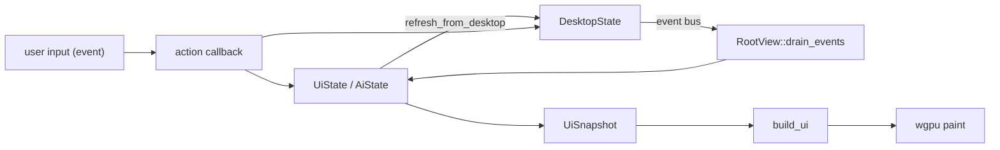

# 06 — Renderer architecture

**Status:** `[x]` core working
**Owns:** the data/state/actions/event flow in the renderer
**Depends on:** [`README.md`](README.md)

## Components

- **`goble-ui`** — the primitive layer: elements, layout (`warp::LayoutContext`-style), paint, geometry, color/theme, `platform/*` (winit window, wgpu render engine, text + icon atlas). Its design direction/tokens/icon assets come from `~/Projects/warp-new` (see [`README.md`](README.md)); `octomusui` in warp-new is the sibling reference for a from-scratch Rust renderer.
- **`goble-ui-hot`** — the cdylib that owns `build_ui(...)` and the snapshot/action types (`UiSnapshot`, `UiActions`, `AiSnapshot`, `AiActions`, `AppTab`). It is hot-reloaded (see `app/src/hot_ui.rs`).
- **`app/` (`goble-app`)** — the executable: owns `UiState`/`AiState`, the `make_actions`/`make_ai_actions` callbacks, `RootView`, and the hot-reload handshake. The element tree is rebuilt from state **every frame**; state is kept in the executable so text focus/value survive rebuilds.

## Data flow

## Backend wiring (what's real)

`make_actions`/`make_ai_actions` receive `Option<Arc<DesktopState>>`. When `Some` (production, via `DesktopState::open_default`), actions call the real methods — chats, cron/workflows, LLM settings, workers, vault, cluster, MCP connectors. When `None` (store couldn't open) they fall back to in-memory mock. See [`app/src/actions.rs`](../../app/src/actions.rs) and [`app/src/ai/actions.rs`](../../app/src/ai/actions.rs).

## Current gaps (vs target product)

- The **first-run flow is wired**: no-key banner → Settings→LLM → local/remote choice → continue local, driven via `chat.rs` + `actions.rs` and covered by `integration_testing/first_run_flow.rs`.
- `on_send_message` drives the **harness** (`DesktopState::run_chat_turn` → `Harness::run_turn`), which persists the user + assistant/tool messages and emits `chat:updated` (deterministic `MockProvider` in tests; canned reply only on the no-key path). Assistant deltas **stream** into a single message row, so the renderer shows the reply progressively; the Stop button cancels the turn.
- The composer **model selector** drives `run_chat_turn` (populated from the provider catalog) and the **Stop button** cancels a running turn; `agent_busy` now reflects the turn lifecycle (true on send, cleared by `chat:turn_finished` or Stop). attach/voice, copy/restart/menu are still stubs/logs.
- `AppTab` only has Threads/Chat/Settings; agents/executions/logs/teams/workflows pages are not in the native shell (they exist in the legacy React app).
- Threads tab content is mock-only (not wired to `ThreadStore`).

## Tasks

- [x] Drive the chat from the harness (replace the canned reply with real events) — `on_send_message` runs `Harness::run_turn`, so tool-call output persists to the chat; delta-level streaming to the renderer is a separate task.
- [x] Render tool calls distinctly to match warp-new — `refresh_messages` maps `role="tool"` rows to `ChatRole::Tool`; the assistant message's `tool_calls` metadata renders as a raised `surface_2` card (`Border` 1px, radius 8, mono body) above the reply, and a tool result renders the same card style via `TerminalBlock`. The composer is a floating `surface_1` card (see `design-tokens.md`).
- [ ] Add the missing product pages (agents, executions/traces, logs) to the native shell.
- [ ] Wire the model selector + attach/voice to real behavior.
