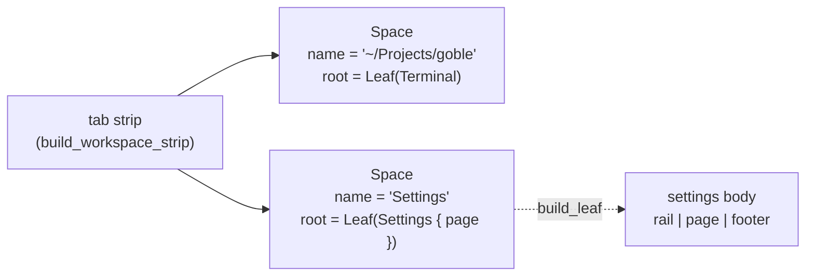

# 10 — Settings as a tab: the surface, its keyboard, and the two files behind it

**Status:** `[x]` implemented, except `Environment2`, `Environment3` and `SSH2` (`[~]`), which are the two file-backed pages still landing
**Owns:** Settings as a first-class topbar tab ("exactly like warp-new"), the single-instance rule for it, the keyboard contract inside it (`Enter`/`Esc`), the chord that switches tabs, and the two file-backed pages it will hold — Environment (groups of variables in a commented TOML) and Connections (the hosts in `~/.ssh`).
**Depends on:** [`03-shell-layout.md`](03-shell-layout.md), [`07-topbar.md`](07-topbar.md), [`../../03-workspace-model/shared-secrets-and-toml.md`](../../03-workspace-model/shared-secrets-and-toml.md), [`../../03-workspace-model/workspace.md`](../../03-workspace-model/workspace.md), [`../agent-tui.md`](../agent-tui.md) §11

## How to read this doc

Anchors for the two references, the same scheme [`../agent-tui.md`](../agent-tui.md) uses:

- `W/…` = `/Users/adrian.tucicovencogmail.com/Projects/warp-new/app/src/…` — the reference app.
- `G/…` = `/Users/adrian.tucicovencogmail.com/Projects/grok-build/crates/codegen/xai-grok-pager/src/…` — the reference TUI (the source of the settings page list, and of the vim keys).
- Our own code is referenced by path with no prefix.

## 1. What was asked for

The user's words, translated:

- "Settings would sit very well as its own tab at the top, exactly like in warp-new, and it should appear exactly as a space of panels."
- "If we press the button several times it takes us to the same settings tab; we don't open several."
- "Since we navigate only with the keyboard, we should have an `Enter`/`Esc` mechanism to edit something."
- "We should add a shortcut to switch between tabs."
- "The menus where we configure environment variables should also create a TOML file, with a structure we comment at the top."
- "The one with the SSH connections should look in `~/.ssh`."
- "Switches should be square" — someone else's item; recorded here only as the related item it is (see §9).
- "Again, I would prefer that we work on documents."

Six decisions follow, one per section: a settings tab **is a space whose root is a settings leaf** (§3), there is **never more than one** (§4), the keyboard contract is the existing two-region model with `Esc` no longer closing (§5), tab switching is **`Ctrl+Tab` / `Ctrl+Shift+Tab`** (§6), Environment moves to **`~/.goble/environment.toml` with a commented header** (§7), and Connections **reads `~/.ssh`** (§8).

## 2. What exists today

| Piece | Where | State |
|---|---|---|
| Tab strip | `app/src/ui/shell/topbar.rs` — `build_topbar` (:90), `TabStrip`/`TabFrame` (:330-460), `tab_slot` (:67) | Tabs come from `state.spaces` (workspace tabs, `build_workspace_strip` :1081) plus a second frame of **file** tabs derived from the active space's `PaneKind::File` leaves (`build_file_tabs` :846). Both are full-height square surfaces with a hover ✕ (`WorkspaceChip` :1208, `FileTab` :938). |
| Space / pane model | `app/src/ui/pane.rs:6-12` (`PaneKind`), `:34-43` (`Pane`), `:292-314` (`Space`) | A `Space` is a name, a `named` flag, a medium and a `Pane` tree. Leaves are `Chat`, `Terminal`, `File { path }`. `Space::set_leaf_kind` (:391) re-points an existing leaf at other content; `open_file_pane` (`app/src/actions/pane_ops.rs:37-67`) is the existing "open a thing in a pane" path. |
| Layout persistence | `app/src/state/paths.rs:6-14` (`PersistedPaneState`), `app/src/state/ui_state/spaces.rs:9-68` (`restore_panes`), `:70-81` (`save_panes`) | Spaces, the active space/pane and the per-pane sessions are serialized to the store as one blob. `PaneKind` is part of that blob (`app/src/ui/pane.rs:8`). |
| The settings surface | `app/src/ui/settings.rs` (1424 lines) | One 640 × 520 **overlay** (`PANEL_WIDTH` :92, `PANEL_HEIGHT` :98) mounted in a `Dialog` (`app/src/ui/build.rs:146-151`), opened by `on_settings` (`app/src/actions/make_actions.rs:1139-1146`), gated by `UiState::settings_overlay_open` (`app/src/state/ui_state/mod.rs:158`). Rail + content column + a footer naming the focused region's keys (`build_settings_overlay` :224, `build_nav` :480, `build_footer` :391). Seven pages, `SettingsCategory` (`app/src/ui/types.rs:176-212`). |
| The keyboard model | `app/src/ui/settings.rs:19-86` (the module's own map), `:335-385` (the `KeyHandler`, `KeyHandler::new` at `:335`), `app/src/state/ui_state/settings.rs:80-260` | Two regions (`SettingsFocus::{Rail, Pane}`), a focus order per page (`SettingsControl`, `app/src/ui/types.rs:230-298`; `pane_controls` `app/src/ui/settings.rs:114`), `Enter` activates the focused row, a text field takes the caret on the first `Enter` and commits on the second, `Esc` cancels the edit and otherwise steps back and closes the sheet from the rail. |
| Global chords | `app/src/root_view/element.rs:66-123` | Handled before the tree: `⌘K`, `⌘Space`, `Ctrl+.`, `⌘⇧D`, `⌘⇧T`, `⌘⇧W`, `⌘W`, `⌘←↑↓→`. |
| Native menu chords | `crates/goble-ui/src/platform/mac/menus.rs:288-442` | Settings… `⌘,`, New Space `⌘N`, New Terminal `⌘⇧T`, Close Pane `⌘W`, Copy `⌘C`, Split Right `⌘Space`, Split Down `⌘⇧D`, Fullscreen `⌃⌘F`, Right Sidebar `⌃⌘B`, Zoom `⌘+ ⌘- ⌘0`, Hide `⌘H`, Quit `⌘Q`. |
| A second, unused tab model | `crates/goble-ui/src/elements/shell.rs:21-37` (`ActiveView::Settings(SettingsTab)`), `app/src/ui/shell/content.rs:31-44` (`AppTab`) | `AppTab::Settings` exists but renders `build_settings_disabled` (`content.rs:43-86`) — "Settings is disabled in this version". `AppTab` is the full-window mode model (Projects, Workflows, …, each with a Back button); the strip is not drawn there. |
| Environment storage | `crates/goble-desktop-service/src/state/environment.rs`, `crates/goble-core/src/store/secret_groups.rs`, `crates/goble-core/src/store/schema.rs:211-232` | Groups of secrets in two SQLite tables (`secret_groups`, `secret_group_entries`, DDL at `:214-229`), values **plaintext** (`secret_groups.rs:1-8`). No file, no export. |
| `~/.ssh` today | `app/src/ui/settings.rs:1374-1383` (the Advanced page's read-only "SSH keys" row), `:1410-1424` (`ssh_configured`) | The only thing any goble UI reads under `~/.ssh` is whether a file named `id_*` exists. No host list, no `config` parsing, no known-hosts handling. |
| SSH elsewhere | `crates/goble-desktop-service/src/ssh_installer.rs:24-31` (`SshCredentials`), `:151-171` (`run_ssh`), `crates/goble-core/src/provision.rs:70-140` (`SshTransport`), `crates/goble-desktop-native/src/state_api/workers.rs:59-84` (`InstallWorkerRequest`) | The worker-install flow takes host/user/port/private-key **text** from its caller. Nothing in `app/` calls it, so **there is no SSH-connections surface in the shipping UI at all** — see §8 and open question 1. |

## 3. Decision 1 — a settings tab is an ordinary space whose root is a leaf of kind Settings

**The choice.** Add `PaneKind::Settings { page: SettingsCategory }` to `app/src/ui/pane.rs:6-12`, and make a *settings tab* an ordinary `Space` whose root is a single leaf of that kind (`Space::new("Settings", Pane::Leaf { id, kind: PaneKind::Settings { page: SettingsCategory::Appearance } })`). Opening Settings the first time creates that space; the surface it draws is the existing rail + page + footer, mounted as the pane's body instead of inside a `Dialog`. The `AppTab` mode is not involved, and no new tab kind is invented.



**Why.** It is exactly the reference's own answer, one level down. warp's settings surface is a **pane**: `SettingsPane` is a `PaneContent` whose inner view is a `SettingsView` (`W/app/src/pane_group/pane/settings_pane.rs:14-46`), the pane's persisted identity is a leaf-content variant, `LeafContents::Settings(SettingsPaneSnapshot::Local { current_page, search_query })` (`:98-108`), and *every* entry point — the `⌘,` binding, the menu item, the per-page actions — funnels through `open_settings_pane`, which **adds a tab** whose layout is a single leaf of that kind (`W/app/src/workspace/view.rs:7963-8006`, `add_tab_with_pane_layout(.., Some("Settings".to_owned()), ..)`). warp has no settings modal; `show_settings` closes overlays and calls the pane path (`W/app/src/workspace/view.rs:17508-17519`). Because goble's tab *is* a `Space`, "a settings tab" is the same statement in our vocabulary, and it inherits the whole strip for free — `tab_slot`'s equal-share arithmetic (`app/src/ui/shell/topbar.rs:67-73`), the full-height square chip with the hover ✕, and the double-click inline rename — without a line of new strip code.

**The alternative rejected.** A `Space`-level flag (`Space { kind: SpaceKind::Settings }`) would make "settings" a property of the whole tab and not of what the tab holds: it cannot be split (so a terminal cannot sit beside a setting, which warp allows because its settings is a pane), it needs a special case in every function that walks spaces (`space_label` `app/src/state/ui_state/spaces.rs:120-155`, `refresh_space_labels` `:157-166`, `refresh_settings`, the pane-drag drop targets, `build_main`), and it makes `PaneKind` and "what a tab is" disagree. The pane kind costs one match arm.

**The second alternative rejected.** Restoring `AppTab::Settings` (`app/src/ui/types.rs:163-172`) as a full-window mode: `AppTab` is a *second* tab model that replaces the whole content region below the topbar and is not in the strip (`app/src/ui/shell/content.rs:29-44`); its pages are dead-ends with a Back button. The user asked for a tab that appears "exactly as a space of panels", not a mode to back out of.

**What it means for the four surfaces the tab touches.**

- **The tab strip.** Nothing. The settings space is another entry in `state.spaces`, so it is laid out, hovered, renamed, reordered (drag) and closed by the existing code. Its label is its name with `named = true`, so `refresh_space_labels` (`spaces.rs:157-166`) never overwrites it, and `space_label` (`:120-155`) never derives it from a path or a conversation. Two details fall out of the existing design: **no file tab appears for it** (`Pane::file_leaves` collects `PaneKind::File` only, `app/src/ui/pane.rs:88-103`), and the strip must be visible for the tab to be seen — which means `open_settings_tab` also sets `state.current_tab = AppTab::Chat`, because the strip is drawn only in `AppTab::Chat` (`content.rs:31`) and a Settings press from the Projects mode would otherwise create a tab the user cannot see.
- **The sidebar.** Unchanged. The sidebar's three views follow the active pane's working directory (`SidebarView`, `app/src/ui/types.rs:303-339`; `app/src/ui/sidebar.rs:1888` highlights the file the active pane shows), and a settings leaf gets an ordinary empty `PaneSession` from `ensure_all_chat_pane_sessions` (`app/src/state/paths.rs:49-62`), exactly as a file pane does. `open_settings_tab` never binds a conversation to it (`bind_pane_new_conversation` is not called), so the sidebar's selection is untouched.
- **The pane split.** Settings composes with the tree because it *is* a leaf: `⌘Space` splits it like any pane, `⌘←↑↓→` walks in and out of it, and `⌘W` on it does nothing when it is the space's root — `Pane::remove_leaf` returns `None` for a root leaf (`app/src/ui/pane.rs:264-266`) and `on_close_pane` leaves `active_pane_id` alone (`app/src/actions/make_actions.rs:1517-1543`). The tab's ✕ closes the whole space. If the settings leaf is a *split* beside a terminal, `⌘W` closes just that leaf and the space survives on the terminal; the next Settings press then opens a fresh tab (§4, case 4).
- **Session persistence.** Free, and for the reason the file pane already relies on: `PersistedPaneState` serializes `Space`/`Pane`/`PaneKind` as-is (`app/src/state/paths.rs:6-14`), and `restore_panes` recomputes `next_pane_id` from the restored tree (`spaces.rs:40-44`), so a settings tab comes back as itself. Carrying the page *in the leaf* (`PaneKind::Settings { page }`) is the warp behaviour (`SettingsPaneSnapshot::Local { current_page, .. }`, `W/app/src/pane_group/pane/settings_pane.rs:98-108`): the tab reopens on the page it was on, the page travels with the pane if the pane is lifted onto the strip, and `UiState::settings_category` (`app/src/state/ui_state/mod.rs:160`) becomes a derived read through `Space::leaf_kind`/`set_leaf_kind` (`app/src/ui/pane.rs:386-389`, `:391-394`) instead of a second copy that can drift. One honest cost: `PaneKind` is a serialized enum, so a layout written by this build is not readable by an older one — `restore_panes` logs and keeps the in-memory defaults (`spaces.rs:12-18`), which is the same treatment every pane kind added since `File` already gets.

## 4. Decision 2 — one settings tab, ever

**The rule.** `open_settings_tab` looks for a leaf of kind `Settings` anywhere in `state.spaces` **by kind, never by name or id**, and:

| Case | What happens |
|---|---|
| 1. Active space, settings leaf is already the active pane | Nothing at all. (`active_space` and `active_pane_id` are left alone; no `save_panes`, so a repeated press is not even a write.) |
| 2. Active space, settings leaf is a different pane of it (a split, or the tab holds several panes) | `active_pane_id = <the settings leaf>`; focus moves into it (`settings_focus = Rail`, `settings_pane_focus = 0`); `sync_active_view()`; `save_panes`. |
| 3. Another space holds it | `active_space = <that space>`, then as case 2; `current_tab = AppTab::Chat` first if it was not. |
| 4. No leaf of that kind anywhere (never opened, or its tab was closed) | Push `Space::new("Settings", leaf)` with a fresh id from `state.next_pane_id`, make it the active space and the leaf the active pane, `ensure_pane_hover`, `refresh_space_labels`, `sync_active_view`, `save_panes` — the shape `on_add_space` already has (`app/src/actions/make_actions.rs:1686-1702`). |

**Why kind, and not a stored id.** The lookup has to survive the two things that change an id: closing the tab (the space, its pane and the id go away, and `next_pane_id` never reuses it) and lifting the pane into another space (`move_pane_to_new_space`, `app/src/state/ui_state/pane_move.rs`). A remembered `settings_pane_id` would be stale after either. A kind lookup is also what the reference does — `SettingsPaneManager::find_pane(window_id) -> Option<PaneViewLocator>`, a manager that keeps **one settings pane per window** and is cleared by `deregister_pane` when the pane detaches (`W/app/src/settings_view/pane_manager.rs:1-94`), consulted first by `open_settings_pane` with the comment "Ensure there is only one settings pane per window" (`W/app/src/workspace/view.rs:7969-7983`) — and warp applies the same shape to a per-object pane in `EnvVarCollectionManager::find_pane`, keyed by the collection's id (`W/app/src/env_vars/manager.rs:36-56`).

**The alternative rejected.** Keying on the space's *name* ("Settings") is a one-line lookup today and breaks on the first rename: the tab is an ordinary space, so the user can rename it with the strip's own double-click (`on_workspace_click`, `app/src/actions/make_actions.rs:1075-1093`) — renaming it to "Prefs" would then open a second settings tab beside it. Keying on kind makes the rename harmless.

**The invariant, and what enforces it.** "At most one settings leaf in `state.spaces`" is enforced on the open path by *set-or-push*, which cannot create a second one. Two things can still produce a layout with two: a hand-edited persistence blob, and a future bug. Decision: `settings_pane()` returns the **first** leaf in traversal order and the extra panes are left alone rather than normalised — a settings leaf is a perfectly renderable pane, so nothing breaks, and silently rewriting a user's layout on load is a worse failure than an unreachable second surface. A test asserts the first-wins rule instead of assuming it.

**Closing.** The tab's ✕ closes the space, the same click that closes any tab (`on_close_space`, `app/src/actions/make_actions.rs:1636-1682`). If it was the last space, that path already replaces it with a fresh chat space, so a Settings press afterwards takes case 4.

## 5. Decision 3 — the keyboard contract: the two-region model, with `Esc` no longer closing

**What already exists, and stays.** The sheet is documented in its own module comment (`app/src/ui/settings.rs:19-86`) and the tab inherits it without change: two regions (`SettingsFocus`, `app/src/ui/types.rs:214-222`), a focus order per page (`pane_controls`, `app/src/ui/settings.rs:114-158`; `FocusOrder` asserts the drawn rows and the order agree), `↑`/`↓` step the region that holds the keyboard (wrapping in the rail, clamped in the pane), `←`/`→` adjust a row that has a discrete value (`SettingsControl::has_discrete_values`, `app/src/ui/types.rs:278-296`) and otherwise step out of / into the pane, `Enter`/`Tab`/`Space` walk into the pane from the rail and **activate** the row in the pane.

**The activation contract, `Enter`.** Unchanged, and it is the mechanism the user asked for:

| Focused row | `Enter` |
|---|---|
| a toggle (dark mode, invert scroll, auto-approve, vim) | flips it |
| a stepper (scroll speed, font size) | advances one step, as `→` does |
| a single-choice row (Local/Remote, a theme channel) | selects the named choice |
| a list row (a group, a secret, a host) | opens it — or, for a secret, loads it back into the fields to edit |
| a text field | **puts the caret in it**; the next `Enter` commits; `Esc` cancels and restores what the field held |
| a button row (create, save, reload, install) | runs it |

The edit half is `UiState::settings_activate_field` / `settings_commit_field` / `settings_cancel_field` (`app/src/state/ui_state/settings.rs:185-220`), which is why `Esc` inside a field is a *cancel* and not a step back: the remembered `settings_field_edit_start` is put back (`:211-220`).

**The one change: `Esc` from the rail does nothing.** Today the rail's `Esc` closes the sheet (`app/src/ui/settings.rs:353-356` → `on_settings_close`). A tab is not a transient surface: closing it on `Esc` would throw away the panel layout, and the tab's own ✕ plus `⌘W`-on-a-split already close it explicitly. So the handler returns `false` for that case, and the key falls through to the tree, where nothing in a settings pane consumes it. The cascade the user asked for ("`Enter`/`Esc` to edit something") is therefore: `Esc` leaves the field → `Esc` leaves the pane (back to the rail) → `Esc` nothing. The footer hints (`footer_hints`, `app/src/ui/settings.rs:415-465`) say so, because the footer is the only place the map is written down for the reader.

**Which rows are editable.** Exactly the ones in the page's focus order — which is the point of `pane_controls`: a page that draws a control without adding it to the order fails its own build through `FocusOrder`, and a control in the order that a page forgets to draw fails too (`app/src/ui/settings.rs:159-208`). The two kinds of non-stop are deliberate and stay: a row with no value and no action (a model entry in Models: "the list is read-only here … so these rows are not focus stops", `:1333-1334`) and a page with nothing interactive (Advanced, `:1366-1408`, whose comment says so). A page added by §7 or §8 must add its controls to `pane_controls` for this to hold.

**How the focus ring and the edit cursor are drawn.** The ring is `focus_ring` — a `ColorToken::Focus` ring around the focused control, and an unfocused control is returned unwrapped so nothing else changes (`app/src/ui/settings.rs:212-222`) — the same blue the focused text field's own ring uses (`ColorToken::Focus`). The edit cursor is the field's, not the sheet's: `TextInput` draws its caret when `.with_focused(..)` and the sheet has the caret (`build_environment`'s group-name field, `:1047-1052`, `.with_focused` at `:1050`), the caret element lives in `crates/goble-ui/src/elements/caret.rs`, and its colour is `ColorToken::Accent` since R29. Nothing new is drawn for edit mode; edit mode is "the field is focused and the sheet knows it" (`settings_pane_field_active`, `app/src/state/ui_state/mod.rs:170`).

**How it composes with the other key owners.**

| Owner | Keys it owns | Why the settings surface does not collide |
|---|---|---|
| Global chords, `app/src/root_view/element.rs:66-123` | `⌘K`, `⌘Space`, `⌘⇧D`, `⌘⇧T`, `⌘⇧W`, `⌘W`, `⌘←↑↓→`, `Ctrl+.` | They are dispatched **before** the tree, so they keep working while settings is up (the sheet's own comment says so, and the handler ignores any key with ctrl/command/alt, `app/src/ui/settings.rs:336-338`). The new tab-switch chord (§6) joins them. |
| The transcript's `e` | `crates/goble-ui/src/views/chat_view/element.rs:50-62` — folds tool calls, but only when the pane is active **and the composer is not focused** | A settings leaf is not a `ChatView`, so `e` never reaches it. In a split with a chat pane, `e` belongs to whichever pane is active, unchanged. |
| The composer's vim mode | `state.vim_mode` (`app/src/state/ui_state/mod.rs:175-178`), applied to the rich input only (`app/src/ui/chat/composer.rs:138-142`, `app/src/ui/chat/agent.rs:283-285`) | The settings surface binds only `↑↓←→`, `Enter`, `Tab`, `Space` and `Esc` outside a field, and everything else to the focused field — so a user in vim mode still gets a non-modal settings page. grok-build's TUI *is* modal (`j/k`, and `Esc`/`Enter`/`Tab` keep their own meanings in both modes, `G/…/app/dispatch/settings/ui.rs:480-491`); open question 9. |
| The terminal's own keys | `app/src/ui/terminal/keys.rs` encodes `Tab`, `Enter`, `Escape` … for the pty (`:91-94`) | A settings pane hosts no pty, so there is nothing to forward to. The terminal's `⌘F` / `⌘⇧F` / `Esc` filter keys (`app/src/ui/terminal/input.rs:140-170`) are per-pane and unaffected. |
| The file view's `⌘S` | `app/src/ui/file_view.rs:882` | The settings tab writes its own files through its rows (§7); no `⌘S` in a settings pane, so a page cannot silently become a text editor. |

## 6. Decision 4 — `Ctrl+Tab` / `Ctrl+Shift+Tab` switch tabs

**The chord.** `Ctrl+Tab` next, `Ctrl+Shift+Tab` previous, on every platform, handled in `RootView::dispatch_event` beside the other global chords (`app/src/root_view/element.rs:66-123`) so a terminal pane cannot swallow it.

**What "switch tabs" means.** It cycles the **workspace tabs** — `state.spaces`, in the order the strip draws them — because those are the tabs. The strip's second frame (file tabs, `build_file_tabs` `app/src/ui/shell/topbar.rs:846-878`) is deliberately **not** in the cycle: a file tab *is* a pane (`PaneKind::File`), and panes already have their own chord (`⌘←↑↓→`, `app/src/root_view/element.rs:109-121`). That split is warp's: `ActivateNextTab`/`ActivatePrevTab` cycle tabs while `ActivateNextPane`/`ActivatePreviousPane` cycle panes (`W/app/src/util/bindings.rs:319-340`; the tab actions are `WorkspaceAction::ActivateNextTab` in `W/app/src/workspace/action.rs:128`). The settings tab is then reachable by keyboard like any other tab, which is the point.

**Ends.** It **wraps**, both ways: last → first, first → last. That is warp's own arithmetic — `activate_next_tab` goes to index 0 past the end and `activate_prev_tab` to `len - 1` below zero (`W/app/src/workspace/view.rs:11014-11060`) — and it is what a browser tab strip does, which is the mental model the strip already borrows. With a single space the chord is a no-op: warp gates the binding on a `Workspace_MultipleTabs` context predicate (`W/app/src/workspace/mod.rs:558-570`), and a wrap over one tab would move nothing but would still write the layout. After the switch, the target tab's first leaf becomes the active pane — `on_select_space` sets `active_space` and `active_pane_id = root.first_leaf_id()` (`app/src/actions/make_actions.rs:1620-1632`) — and if that leaf is a settings leaf the keyboard goes into its rail so the arrows work immediately. Note what this does **not** do: restore the pane that had focus in that tab, because per-tab focus is not tracked ("a background tab's own focus is not tracked", `app/src/state/ui_state/spaces.rs:167-169`). That is existing behaviour, not something this chord introduces, and improving it is a separate item.

**Why not the alternatives.**

- `⌘⇧]` / `⌘⇧[` is what warp binds on macOS (`shift-cmd-}` / `shift-cmd-{`), with `Ctrl+PageUp/PageDown` elsewhere. Rejected: our handler compares the *logical* key string, so it would have to match `}` and `{`, which a non-US layout does not produce from those physical keys — the chord would work on the author's keyboard and nowhere else. `Tab` is layout-free.
- `⌘Tab` is macOS's application switcher; the OS eats it, so a `⌘Tab` binding never arrives. Binding **ctrl only** (not `has_ctrl_cmd`) keeps the chord off the modals' radar too, since `⌘`-something is also what macOS's own window cycling uses.
- `Ctrl+PageUp/PageDown` (warp's non-mac chords) is a second chord to document for no gain on a laptop keyboard without those keys.
- `⌘⇧N` and `⌃⌘B`-style neighbours are already gone (New Space `⌘N`, Right Sidebar `⌃⌘B`); `Ctrl+Tab` is the only chord in the taken set's neighbourhood that is free. What is taken, in full: `⌘K`, `⌘,`, `⌘N`, `⌘⇧T`, `⌘W`, `⌘⇧W`, `⌘C`, `⌘Space`, `⌘⇧D`, `⌃⌘F`, `⌃⌘B`, `⌘+`, `⌘-`, `⌘0`, `⌘M`, `⌘H`, `⌘Q`, `⌘←↑↓→`, `Ctrl+.`, plus the composer's `Enter`/`⌘Enter`/`!`, the file view's `⌘S` and the terminal's `⌘F`/`⌘⇧F` (`crates/goble-ui/src/platform/mac/menus.rs:288-442`, `app/src/root_view/element.rs:66-123`, `crates/goble-ui/src/elements/chat_composer/*`, `app/src/ui/file_view.rs:882`, `app/src/ui/terminal/input.rs:140-170`). `Ctrl+Tab` appears in none of them, and warp uses it for session cycling, i.e. the same "move along the strip" gesture (`CycleNextSession` / `CyclePrevSession`, `W/app/src/util/bindings.rs:275-276`), opening a palette there rather than switching directly.

**Three places the chord must be recorded, or the app lies about itself.** The shortcuts panel draws "only where the app really binds the chord it names, so the panel never promises a key nothing answers" (`app/src/ui/shortcuts_help.rs:4-8`): add the row to `sections()`'s **Workspace** list (`:53-84`), which the panel's own test dispatches to prove it (`every_chord_the_panel_names_is_one_the_app_answers`, `:866-955`). Add a palette entry with its label, and add the two items to the Window menu, whose chord table is where a macOS user looks first (`crates/goble-ui/src/platform/mac/menus.rs:417-428`). One wart to fix while there: the palette's "New space" label already claims `Cmd+Shift+N` (`app/src/ui/build.rs:224`) and *nothing* binds it — `⌘N` is the menu's chord (`menus.rs:358`) — so that label is wrong today and should read `⌘N`.

## 7. Decision 5 — Environment becomes `~/.goble/environment.toml`, with a commented header

**The choice.** Settings → Environment stops writing the store's `secret_groups` tables and reads/writes **`~/.goble/environment.toml`** instead. The file is seeded at first launch with a commented header and no groups, the way `config.toml` is seeded today, and the page's rows are a window onto it — the same relationship Settings → Models already has with `config.toml` ("Model configuration is done by editing the global `~/.goble/config.toml`; this sheet only lists the resulting models and offers a reload", `app/src/ui/settings.rs:7-9`), except that the Environment rows write too.

**The file and its header.** `GobleHome` gains `environment_path()` beside `config_path()` (`crates/goble-core/src/app_home.rs:99-101`), seeded in `ensure_base` by the same helper `seed_config_if_missing` uses (`crates/goble-core/src/app_home.rs:151-160`) so an existing file is never touched, and the header is a `const` in the same place and the same style as `CONFIG_HEADER` (`:48-64`):

```toml
# goble environment groups: the named sets of variables a session starts with.
# Settings -> Environment shows this file, and its rows write it back, so the
# table below and the page are the same data. Edit it by hand if you like; press
# "Reload from file" on that page afterwards.
#
# One [groups.<name>] table per group. Every key in the table is one variable of
# that group, and its value is a string:
#
#   [groups.production]
#   LOG_LEVEL = "info"
#   API_BASE  = "https://api.example.com"
#
# A value that must not sit in this file is an inline table naming the key an
# encrypted vault holds instead; the value itself never appears here:
#
#   DEPLOY_TOKEN = { vault = "deploy-token" }
#
# A group's name is its table key, so `[groups.staging-eu]` needs no quoting and
# `[groups."Staging EU"]` does. Deleting the table deletes the group.

```

**The shape, and the one non-obvious rule.** Two levels: group name → variable name → value. The value is either a string or `{ vault = "<key>" }` (an inline table, not a sub-table: a sub-table forces the group's own keys above it, because TOML requires a table's key-value pairs before its sub-tables, which is a footgun for a hand-edited file). `EnvironmentFile` is a `BTreeMap<String, BTreeMap<String, EnvValue>>` — `BTreeMap` so a save writes groups and variables in a stable alphabetical order and a hand edit produces no churn — with `EnvValue` an untagged enum (`Literal(String)` | `Vault { vault: String }`). A hand-written `{ vault = .. }` **round-trips**: the UI never resolves it, and a save of another variable writes it back as it was read. The UI's own rows write the literal form only, because that is what the store holds today (values are plaintext, `crates/goble-core/src/store/secret_groups.rs:1-8`); the vault form is the door to a future where the pane writes a reference instead of a value, and it costs one enum arm now rather than a file-format change later.

**Reading and writing, and where the code lives.** `goble-core` owns the type, because it is where `toml` and `dirs` already are (`crates/goble-core/src/app_home.rs`, `crates/goble-core/src/config/mod.rs:186-190`); `app` does not depend on `toml` at all (`app/Cargo.toml`). `DesktopState`'s environment accessors (`crates/goble-desktop-service/src/state/environment.rs:20-88`) keep their signatures and change their body: `environment_groups()` reads and parses the file, `create_environment_group` / `save_environment_secret` / `delete_environment_*` rewrite it through the one writer, so the pane's existing call sites in `app/src/state/ui_state/settings.rs:293-404` do not change at all. Two consequences of the file becoming the identity:

- A group's **id becomes its name** (the table key). `settings_environment_open_group` (`app/src/state/ui_state/mod.rs`) holds the name; the uuid the store minted (`environment.rs:34-47`) and the `SecretGroup`/`SecretEntry` ids (`crates/goble-core/src/store/secret_groups.rs:16-31`) have no place in the file. `SecretGroup` keeps its shape for the UI's sake, with `id == name` for file-backed groups.
- `save_environment_secret`'s `renamed_from` argument still works, because a rename is a delete of one key plus an insert of another in the same table; it just no longer needs the store's "remove the old row first" dance (`environment.rs:71-78`).

**Malformed files.** The contract is `GobleConfig::load_toml`'s — forgive per part, never overwrite what cannot be parsed (`crates/goble-core/src/config/mod.rs:209-236`; `DesktopState::reload_config`'s comment: "a bad edit must not wipe the models the app is configured with", `crates/goble-desktop-service/src/state/bootstrap.rs:111-121`):

| The file | What happens |
|---|---|
| Missing | Not an error: the page shows "No groups yet" and the path. The first write creates the file with the header. (`ensure_base` seeds it anyway at first launch.) |
| Not TOML at all | Nothing is written over it. The page shows an error row naming the file and the parse message, keeps the groups it last read (empty on first load), and every write is refused until it parses. |
| A group whose value is not a string or `{ vault }` (an array, a nested table) | That group is dropped and reported as one message; the other groups load and are drawn. |
| A duplicate table/key | TOML rejects it, so it is the "not TOML at all" row above — refused, not merged. |

warp's shape for the same situation is the model for the *reporting*: a parse failure is one error with a user-facing heading and description, shared by the banner and the settings rail's footer so the two cannot drift (`W/app/src/settings/mod.rs:69-120`, `W/app/src/settings_view/settings_file_footer.rs:150-200`), and a per-value failure falls back to the default rather than failing the file (`SettingsFileError::InvalidSettings`). Our version is a row on the page, because our settings surface has no banner and no footer rail of its own to hang it from.

**The alternative rejected: making the file a mirror.** Keeping the store as the source of truth and exporting the file on every change gives two writers and no answer to "I edited the file, why did my change vanish at the next click". The user asked for a file "with a structure we comment at the top" — a file worth hand-editing is a file the app reads, not one it overwrites. The alternative of folding the groups into `config.toml` as `[env.<group>]` was also rejected: the config file's own layout is the model catalogue and it is what the remote workspace ships (`crates/goble-core/src/config/mod.rs:1-11`), so the git-style separation the user asked for ("also create a TOML file") is better served by one file per concern.

**What happens to the store tables.** They stay in the schema and gain no writers (`crates/goble-core/src/store/secret_groups.rs` keeps compiling; `schema.rs:214-229` keeps the tables). A one-shot migration runs on the first read: if the file has no groups and the store has some, the store's groups are written into the file with the header, and the message is logged. The store is then stale and never read again for this purpose — dropping the tables is a separate cleanup, deliberately not bundled here so a user who rolls back does not lose their groups.

**Permissions.** The file is written `0600` on Unix, through `std::os::unix::fs::PermissionsExt::set_mode` — the crate goble would import for it is already imported in the tree for the installer's `0o755` on a binary it owns (`crates/goble-update/src/install.rs:249-255`); `0600` for a written file does not exist anywhere in goble yet, so this is new code with an existing precedent for the mechanism, not for the mode. `config.toml` itself is written with a plain `fs::write` and the process umask (`crates/goble-core/src/app_home.rs:157`), which is why this is called out separately. The values are plaintext — exactly as the store stores them today — so this is not a new secret store, it is a smaller blast radius for the same plaintext.

**What the page gains.** A "Reload from file" row (the Models page's `ReloadModels` control, `app/src/ui/settings.rs:1354-1361`) so a hand edit lands without a restart, and the file's path in the hint text, spelled out the way the Models heading names it (`:1320`). `refresh_environment_groups` (`app/src/state/ui_state/settings.rs:267-289`) is already the "re-read and adjust the focus" path a reload needs.

## 8. Decision 6 — the Connections page reads `~/.ssh`

**The surface.** A new settings page, `SettingsCategory::Connections`, holding the SSH connections this machine already knows — read from `~/.ssh`, never stored by goble. It sits after `Environment`, and the Advanced page's read-only "SSH keys" row (`app/src/ui/settings.rs:1374-1383`) moves to it, because a page that reports the machine's SSH state is where the host list belongs.

**Which files are read, and what is read out of them.**

| File | Read | Displayed |
|---|---|---|
| `~/.ssh/config` | `Host` blocks: `HostName`, `User`, `Port`, `IdentityFile` | One row per **concrete** block: alias, `user@hostname:port` (the fields the block sets, falling back to the alias and the OpenSSH defaults 22 / current user), and the identity file's path. |
| `~/.ssh/id_*` (and anything the block's `IdentityFile` names) | The **existence** of the file only — never its contents | A key row per file: its name, and whether the `IdentityFile` that names it exists (a block pointing at a missing key is worth seeing). This generalises the check `ssh_configured()` already does (`app/src/ui/settings.rs:1410-1424`). |
| `~/.ssh/known_hosts` | The host token at the start of each line | A `known` marker on a row whose host was added by this machine, so the list says which connections have actually been used. |

**Parsing `~/.ssh/config` — the subset, stated.** The file is `ssh_config(5)`: keyword lines are `Key value`, blocks start with `Host <pattern> …`, and (the part that makes a naive parse wrong) *within* a block the **first** value of a keyword wins, while across blocks the first block whose pattern matches supplies each keyword. We implement the shape a picker needs and no more: split the file into ordered blocks; inside a block, the first `HostName` / `User` / `Port` / `IdentityFile` seen wins (`IdentityFile` accepts more than one and we keep them all, first used); and **only blocks whose pattern list has no wildcard become rows** — `Host *`, `Host *.internal` and `Host !prod` are rules, not connections, and showing them as connections would be a lie. The one place this is visible in the UI: a block that sets no `HostName` shows its alias as the host, which is also what `ssh` connects to, so the row is still true. `Match` blocks are ignored (they are conditional), and `Include` is **not** followed in this item: following it means glob expansion and recursion, and a wrong include silently invents hosts. The cost is that hosts pulled in by an `Include` are missing from the list — stated in the page's own hint, not left as a surprise. Sorting is by alias, and the parse is a pure function over the file's text, so it is tested against fixtures rather than against a real home directory.

**Displayed, and what is deliberately not.** Each row shows what a connection needs to be chosen — alias, target, user, key, whether it is known — and nothing that is a secret: no key material, no passphrase, no `ProxyJump` command. Row activation (`Enter`) does **not** connect: opening a session over SSH is not something this build can do (`run_ssh` runs commands for the worker installer, `crates/goble-desktop-service/src/ssh_installer.rs:151-171`; nothing in `app/` calls it). What activation does is prefill — it selects the row and names it, so the row is the source of a target for whatever consumes it next. That consumer today is the worker install (`SshCredentials { host, user, port, private_key }`, `:24-31`, built from `InstallWorkerRequest` in `crates/goble-desktop-native/src/state_api/workers.rs:59-84`), which takes the key's **contents**; the page hands over the key's **path**, and whoever installs reads the file at that moment. The path is what the file records; the contents are never written anywhere.

**When `~/.ssh` does not exist or has no `config`.** A normal machine state, not an error and not an empty page: the page draws the three findings it can make — no `~/.ssh` directory, the directory exists with no `config`, or a `config` with no concrete host — each as a muted line naming what is missing and the presumed path, plus the key file list when there is one. That is the honest version of the Advanced row that says "none found" today. A `known_hosts` holding only hashed entries (`|1|…|…`) is reported as a count, because those host names are not recoverable from the file and guessing them is not on the table.

## 9. What this does not cover

- **Square switches.** The user's other request ("switches should be square") is a separate agent's item: it touches the `Switch` element the settings rows already use (`app/src/ui/settings.rs:680-692`, `switch_row`) and every other switch in the app, and nothing in this document depends on its outcome. Recorded here only so the dependency is visible: a page's rows are laid out by `setting_row` (`:578-605`), which is indifferent to the switch's shape.
- **The environment group's actual use.** Nothing transmits the groups to a remote session yet; the crate says so in its own words ("**No server side exists yet** … these groups are read by the settings pane and stop there", `crates/goble-desktop-service/src/state/environment.rs:1-10`). Moving them to a file does not change that, but it does change what ships: `remote-bootstrap.md`'s package must now carry `environment.toml` as well as `config.toml`.
- **A vault-backed environment.** The `{ vault = ... }` form is read and round-tripped, not written. Wiring the pane's Value field to `CredentialVault` is the step that follows, and it is the path `shared-secrets-and-toml.md` rule 1 describes.
- **Per-tab focus memory.** The tab-switch chord lands on a tab's first leaf, as `on_select_space` already does; remembering which pane had focus per tab is a separate item.
- **A search box in the settings rail.** warp's settings view has a query that travels with the pane (`W/app/src/pane_group/pane/settings_pane.rs:98-108`); ours has no rail search, so the leaf's page is the only state it carries.
- **Vim motion inside settings** (see open question 9).

## 10. Open questions for the user

1. **Which surface did you mean by "the one with the SSH connections"?** There is no SSH-connection surface in the app today — `app/src/ui/connectors.rs` is MCP servers only (`:1-15`, `McpServerEntry`), and the only `~/.ssh` reader is the Advanced page's `configured`/`none found` row. This document designs a **Connections** page that lists the hosts in `~/.ssh/config` (with keys and known hosts). If you meant the topbar's Local/Remote **environment** list (`app/src/ui/media.rs`) or the worker-install form, say so and §8 changes shape.
2. **May the Environment page keep writing values in the clear?** The store stores them plaintext today, so the file is no worse — but `03-workspace-model/shared-secrets-and-toml.md` rule 1 says a TOML never holds a key *value*. Should the page write `{ vault = "..." }` for a variable you mark as a secret (with the vault's unlock prompt as a consequence), or keep literals until the vault wiring lands?
3. **Do you want the UI to preserve your hand-written comments in `environment.toml`?** Preserving them needs a comment-preserving writer (the `toml_edit` crate, a new dependency); without it the header is re-emitted on every save and a comment you add inside the file is lost on the next row edit.
4. **`Environment` or `~/.goble/env.toml`?** The page is "Environment"; the file name proposed here is `environment.toml`, next to `config.toml`.
5. **Should the Settings tab be renamable and closable like any other tab?** This document says yes (it is an ordinary space: double-click renames, hover ✕ closes, the lookup is by pane kind so neither breaks the single-instance rule) and that `Esc` from the rail does nothing.
6. **`Ctrl+Tab`, or warp's `⌘⇧]` / `⌘⇧[`?** `Ctrl+Tab` is layout-independent and free; warp's mac chords are what your muscle memory may already have, at the cost of matching a shifted bracket character.
7. **Should `⌘,` (already the Settings menu item, `crates/goble-ui/src/platform/mac/menus.rs:321-325`) also appear in the shortcuts panel?** It is answered by the menu rather than by the key handler, so the panel does not list it today.
8. **Should the Connections page offer "Install worker on this host"?** It would give the page a verb, at the cost of pulling the install flow (and its progress UI) into this document.
9. **Vim motion inside the settings tab?** grok-build's TUI navigates settings with `j/k` when vim mode is on (`G/…/app/dispatch/settings/ui.rs:480-491`); goble's vim mode is composer-only, so today the settings page ignores it.

## 11. Work items

Each item is one turn of work: small, fully defined, verifiable on its own, and dependency-ordered. `Settings1`–`Settings4` are the tab; `Environment1`–`Environment3` and `SSH1`–`SSH2` are its pages and can be done by a different agent once `Settings1` has landed.

| # | Item | Where | Depends on | Verified by |
|---|---|---|---|---|
| Settings1 | `[x]` **`PaneKind::Settings { page }` and the settings body as a pane.** Add the variant (with `Serialize`/`Deserialize` on it and on `SettingsCategory`), handle it in `build_leaf` — the rail + page + footer body filling the pane, its own header band carrying the pane title and the ✕ that closes the space — and make the geometry pane-relative (`PANEL_WIDTH`/`PANEL_HEIGHT` stop applying to it). Factor the body out of `build_settings_overlay`; the overlay stays mounted for now. | `app/src/ui/pane.rs`, `app/src/ui/types.rs`, `app/src/ui/panes.rs`, `app/src/ui/settings.rs` | — | `cargo test -p goble-app` — a layout whose space holds a settings leaf draws the rail's page labels and the page's rows (assertions over the drawn commands, the `frame`/`drawn` pattern `settings_category_tests` already uses, `app/src/ui/settings_category_tests.rs:346`) |
| Settings2 | `[x]` **`open_settings_tab` and the single-instance rule.** `UiState::settings_pane() -> Option<(usize, u64)>` (first settings leaf in traversal order), `open_settings_tab(desktop)` implementing the four cases of §4, `on_settings` rewired to it, `current_tab = AppTab::Chat` on the way in. Then remove the overlay path: `settings_overlay_open`, the `Dialog` mount, `AppTab::Settings` and `build_settings_disabled`; repoint `chat_flow::select_tab_switches_views` (`app/src/integration_testing/chat_flow.rs:216-221`) at another `AppTab`. | `app/src/state/ui_state/spaces.rs` (or `panes.rs`), `app/src/actions/make_actions.rs:1139`, `app/src/ui/build.rs:146-151`, `app/src/ui/shell/content.rs:34,43-86`, `app/src/ui/types.rs:163-172` | Settings1 | `cargo test -p goble-app` — pressing `on_settings` twice leaves `spaces.len()` unchanged and leaves `active_space`/`active_pane_id` on the settings leaf; with the tab in a background space the press switches to that space; after closing the tab the press adds exactly one space; a hand-built layout with two settings leaves focuses the first and normalises nothing |
| Settings3 | `[x]` **The keyboard contract in a tab.** `Esc` from the rail returns `false` (the tab stays); the page is read and written through the settings leaf (`settings_page()` / `settings_set_page()` replacing the `settings_category` field); the footer hints say what `Esc` does now. | `app/src/ui/settings.rs:335-385`, `app/src/state/ui_state/settings.rs:104-124`, `app/src/state/ui_state/mod.rs:160` | Settings2 | `cargo test -p goble-app` — the rewritten `settings_category_tests` key assertions pass against the tab, plus: `Esc` from the rail leaves the space count and the open tab unchanged; `Enter` on a field enters the caret, a second `Enter` commits, `Esc` restores |
| Settings4 | `[x]` **`Ctrl+Tab` / `Ctrl+Shift+Tab`.** The chord in `RootView::dispatch_event`, `UiState::switch_space(delta)` (wrap, no-op at one space, rail focus when the target holds a settings leaf), a `Workspace` row in `sections()`, a palette entry, the two Window-menu items — and fix the palette's "New space" label to `⌘N`. | `app/src/root_view/element.rs:66-123`, `app/src/ui/actions.rs`, `app/src/actions/make_actions.rs`, `app/src/ui/shortcuts_help.rs:53-84`, `app/src/ui/build.rs`, `crates/goble-ui/src/platform/mac/menus.rs:417-428` | — (independent of Settings1–3) | `cargo test -p goble-app -p goble-ui` — the chord advances the active space and wraps at both ends; one space is a no-op; the panel's "every row dispatches" test still passes with the new row |
| Environment1 | `[x]` **The file, in `goble-core`.** `EnvironmentFile` + `EnvValue`, `load_toml` with per-group forgiveness, `to_toml_with_header`, `ENVIRONMENT_HEADER`, `GobleHome::environment_path()`, seeding in `ensure_base`, `0600` on write. | `crates/goble-core/src/app_home.rs`, a new `crates/goble-core/src/environment.rs`, `crates/goble-core/src/lib.rs` | — | `cargo test -p goble-core` — a group with a literal and a group with `{ vault = ... }` round-trip; a seeded file starts with the header; a group holding an array is dropped with one message while the groups around it load |
| Environment2 | `[~]` **`DesktopState` reads and writes the file.** The five accessors keep their signatures; the store migration runs on the first read; the store methods keep compiling with no callers. | `crates/goble-desktop-service/src/state/environment.rs` | Environment1 | `cargo test -p goble-desktop-service` — create → the file holds `[groups.<name>]`; save → the entry is there; rename → one key replaced, not two; delete → gone; pre-existing store rows appear in the file after the first read |
| Environment3 | `[ ]` **The page names the file and offers a reload.** The hint names the path, a `Reload from file` row reusing the Models page's control, an error row when the file does not parse (writes refused). | `app/src/ui/settings.rs` (`build_environment` :1015, `pane_controls` :114), `app/src/ui/types.rs` (`SettingsControl`) | Environment2 | `cargo test -p goble-app` — a malformed file draws the error row and the reload row; a group added on the page is drawn after a reload from the file |
| SSH1 | `[x]` **The `~/.ssh` reader.** `SshHost { alias, hostname, user, port, identity_files, known }`, `read_ssh_hosts(home) -> SshHosts`, plus the findings for a missing directory / missing `config` / no concrete host, and the hashed-known-hosts count. | `crates/goble-core/src/ssh_hosts.rs` (or `goble-desktop-service`, beside `ssh_installer`) | — | `cargo test -p goble-core` over fixtures: two concrete blocks, a `Host *` block, a `Host !x` block, a block with no `HostName` and no `Port`, an `Include`, a missing `~/.ssh`, a `config`-less directory, hashed `known_hosts` |
| SSH2 | `[~]` **The Connections page.** `SettingsCategory::Connections` after `Environment`; one row per host and one per key file; the Advanced page's SSH row moves here; the categories test splits so the seven grok-build labels stay asserted as a prefix. | `app/src/ui/types.rs:176-212`, `app/src/ui/settings.rs`, `app/src/ui/settings_category_tests.rs:17-31` | Settings1, SSH1 | `cargo test -p goble-app` — a fixture `~/.ssh` draws one row per concrete host with its target and key; the empty and config-less cases draw their lines; no row contains key material |

## 12. Verification, and what is unverified

Everything above is verified by the repository's own test commands — `cargo test -p goble-core`, `-p goble-desktop-service`, `-p goble-app`, `-p goble-ui` — driving a real `RootView` and asserting over the drawn commands, the way `app/src/ui/settings_category_tests.rs` (frames and keys) and `app/src/ui/shell/tests.rs` (tab presses) already do. That is the strongest evidence this workflow can produce, and it is not the same as seeing it.

**Not verified, because this workflow never builds or runs the `goble-app` binary:** that the settings tab *looks* like a space — its chip in the strip, its hover ✕, the rail and page filling the pane; that the focus ring and the field caret read as they should at a real window's scale; that `Ctrl+Tab` feels like tab switching and not like a pane jump; that a hand-edited `environment.toml` is pleasant to write; and that the Connections list matches what `ssh` itself would resolve for the same `config`. The first four are appearance and feel, the last is a semantic gap named in §8 (wildcard blocks, `Match`, `Include`): a row is built from the block's own keywords, not from OpenSSH's full resolution, so a config that leans on wildcards changes what the list shows. Each of those is recorded as unverified rather than claimed.

