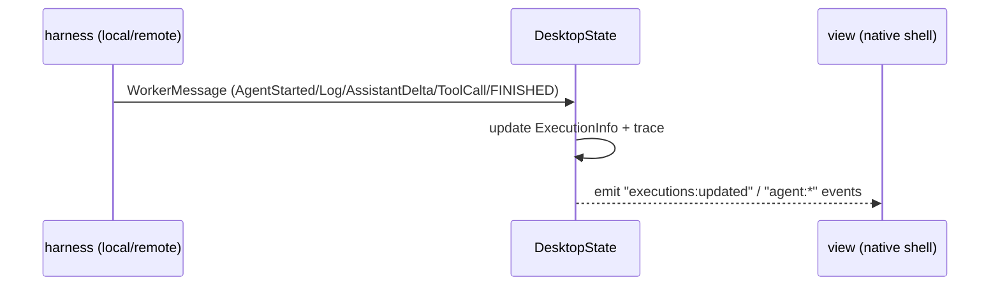

# 07 — Executions & trace

**Status:** `[~]` backend built; UI missing
**Owns:** the execution/trace model and its event flow
**Depends on:** [`README.md`](README.md)

## Model

```rust
struct ExecutionInfo {
    id, agent_id?, worker_id?,
    status: String,          // running | finished status
    trace: ExecutionTrace,
    started_at, finished_at?,
}

struct ExecutionTrace { events: Vec<TraceEvent> }   // TraceEvent::Log | ToolCallStarted | AssistantDelta | ...
```

- One execution = one agent **or sub-agent** run, possibly on a worker. Sub-agents appear as executions **parented** to their parent execution/agent, so the trace composes into a tree.
- **Agent status** (idle / running / waiting-on-sub-agent / paused) is derived from its active executions; this is the agent-level observability the product needs.
- Events are **timestamped and ordered**; as the harness runs (local or remote) it appends to the trace.

## Event flow



- For **local** runs, the harness calls the same `handle_worker_message` path (or an in-process equivalent) so local + remote surface the same shape.
- `DesktopState` already owns `list_executions`, `get_execution_trace`, `insert_execution`.

## The gap

`root_view.rs` only drains `chats:updated`, `workflows:updated`, `agents:updated`, `vault:updated`. It does **not** subscribe to `executions:updated` / `agent:*`, and `app/src/ui` has no executions view. So executions are computed but invisible.

The drain half is closed (item C1 of `06-renderer/agent-tui.md` §11, see the first task below). The view half is open, and its first form has landed as the **tasks & workflows overlay**.

## The tasks & workflows overlay (2026-09-13)

`app/src/ui/task_workflow.rs` builds one right-anchored `Sheet` over the workspace: a header (`Tasks & workflows` plus the three counts and a ✕), then a scrollable body with three sections — **Tasks** (the durable ones), **Executions** (the daemon's ledger) and **Workflows** (the registered ones) — each with its own count and an honest empty line when it has no records. The rows are the observability pages' own builders (`app/src/ui/harness.rs`: `build_task_row`, `build_execution_row`, `build_workflow_row`, now `pub(crate)`), so a record is drawn once and the pages and the panel cannot drift apart. Those rows are square `SurfaceRaised` bands (`harness::card` lost its corner radius), matching the transcript and the sidebar.

It is an overlay, not a page: `AppTab` is untouched, the pane tree stays mounted underneath, and it opens with **Cmd/Ctrl+Shift+W** (also a palette entry, "Tasks & workflows") and closes with the same chord, Escape, its ✕, or a click on the backdrop. State: `UiState::task_workflow_open` with `UiActions::{on_toggle_task_workflow,on_close_task_workflow}`.

What it is **not**: the deleted "Work in flight" panel (S7 of `04-agent-runtime/subagents.md`). That one listed in-flight commands and sub-agents with a kill per row and was removed on the user's instruction; this one lists durable records — tasks, executions, workflows — and carries no kill.

## Tasks

- [ ] Drain `executions:updated`/`agent:*` events into app state.
- [ ] Add an executions list + per-execution trace view in the renderer — the **list** now ships in the tasks & workflows overlay above; the per-execution trace view is still open.
- [ ] Make local harness runs feed the same trace path as remote.
