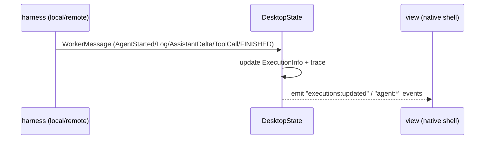

# 07 — Executions & trace

**Status:** `[~]` backend built; UI missing
**Owns:** the execution/trace model and its event flow
**Depends on:** [`README.md`](README.md)

## Model

```rust
struct ExecutionInfo {
    id, agent_id?, worker_id?,
    status: String,          // running | finished status
    trace: ExecutionTrace,
    started_at, finished_at?,
}

struct ExecutionTrace { events: Vec<TraceEvent> }   // TraceEvent::Log | ToolCallStarted | AssistantDelta | ...
```

- One execution = one agent **or sub-agent** run, possibly on a worker. Sub-agents appear as executions **parented** to their parent execution/agent, so the trace composes into a tree.
- **Agent status** (idle / running / waiting-on-sub-agent / paused) is derived from its active executions; this is the agent-level observability the product needs.
- Events are **timestamped and ordered**; as the harness runs (local or remote) it appends to the trace.

## Event flow



- For **local** runs, the harness calls the same `handle_worker_message` path (or an in-process equivalent) so local + remote surface the same shape.
- `DesktopState` already owns `list_executions`, `get_execution_trace`, `insert_execution`.

## The gap

`root_view.rs` only drains `chats:updated`, `workflows:updated`, `agents:updated`, `vault:updated`. It does **not** subscribe to `executions:updated` / `agent:*`, and `goble-ui-hot` has no executions view. So executions are computed but invisible.

## Tasks

- [ ] Drain `executions:updated`/`agent:*` events into app state.
- [ ] Add an executions list + per-execution trace view in the renderer.
- [ ] Make local harness runs feed the same trace path as remote.
