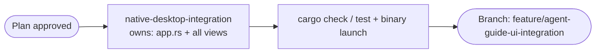

# Native Desktop Feature Integration

## Problem
`goble-desktop-native` builds and runs, but every main view is a placeholder. Chat and Threads render empty containers, Agent/Drive show read-only text lists, and Settings shows static tab labels. The reusable, functional components in `goble-ui` (ChatView, ThreadsContainer, SettingsView) and the full `DesktopState` API from `goble-desktop-service` are not wired into the native app.

## Current state
- `crates/goble-desktop-native/src/app.rs` builds a `ShellView` with a static content resolver.
- Chat and Threads map to `Container(Empty)`.
- `AgentManagementPanel` and `DrivePanel` only print `list_executions()` / `list_workflows()` as text rows.
- `SettingsPanel` prints placeholder text per tab and has no controls.
- `goble-ui` already provides: `ChatView`, `ThreadsContainer`, `ThreadView`, `SettingsView`, `ChatMessage`, markdown formatting, buttons, inputs, switches, etc.
- `goble-desktop-service::DesktopState` exposes: chats/messages, thread store, agents, workflows, executions, workers, vault secrets, LLM settings, cluster identity.

## Proposed changes
1. Introduce a lightweight `UiState` in `goble-desktop-native` that tracks selected chat/thread, active settings page, and dirty flag for rebuilds.
2. Replace Chat placeholder with `ChatView` wired to `state.create_chat`, `state.add_chat_message`, `state.list_chats`, and `state.list_chat_messages`.
3. Replace Threads placeholder with `ThreadsContainer` wired to `state.thread_store()` for listing threads/messages and posting replies.
4. Extend Agent management to list both agents and executions, with actionable rows and a simple "Run" callback that uses `state.run_agent`.
5. Extend Drive to list workflows, agents, teams, and MCP servers with category sections.
6. Replace the custom `SettingsPanel` with `goble-ui::SettingsView` bound to LLM settings, vault unlock, and cluster identity.
7. Add event-bus polling so the UI rebuilds when `CollectingEventBus` emits `executions:updated`, `chats:updated`, `thread:messages:updated`, etc.
8. Keep all changes inside `goble-desktop-native` and `goble-desktop-service` only where getters are missing; do not duplicate UI components that already exist in `goble-ui`.

## Orchestration

**Decision**: Use a single long-running child agent that owns the entire native-desktop integration. This avoids branch/worktree merge complexity and keeps the refactor coherent.

**Dependencies and ordering**
- Research and plan approval (this document) happen first.
- The single agent refactors `app.rs`, splits views into focused modules, wires every view to `DesktopState`, and validates the build.

**Launch config**: Use the plan-attached orchestration config for run-wide model and execution mode. One agent, one branch.

**Child agent**
- **native-desktop-integration** — Implement the full integration in one pass:
  1. Refactor `crates/goble-desktop-native/src/app.rs` and `src/lib.rs` to own shared `UiState`, rebuild hooks, and a content resolver that delegates to reusable `goble-ui` views.
  2. Implement Chat view (`src/views/chat.rs`) using `goble-ui::ChatView` and `DesktopState` chats/messages.
  3. Implement Threads view (`src/views/threads.rs`) using `goble-ui::ThreadsContainer` and `state.thread_store()`.
  4. Implement Agent/Drive view (`src/views/agent.rs`, `src/views/drive.rs`) using agents, executions, workflows, teams, and MCP server APIs.
  5. Implement Settings view (`src/views/settings.rs`) using `goble-ui::SettingsView` bound to LLM settings, vault, and cluster identity.
  6. Add event-bus polling so the UI rebuilds on `CollectingEventBus` events.
  7. Run `cargo check -p goble-desktop-native`, `cargo test -p goble-desktop-native`, `cargo test -p goble-desktop-service`, and launch the binary to verify each view renders functional content.
  Output: branch `feature/agent-guide-ui-integration`, changed files list, and validation report.

**Merge strategy**: The agent works in a git worktree on branch `feature/agent-guide-ui-integration` cut from `feature/agent-guide-ui`. It reports progress and asks for guidance if it hits blockers.

**Artifact exchange**
- The agent reports its worktree path and any public `UiState` / callback contract it introduces.
- On completion it reports the final branch, changed files, test results, and any manual verification notes.

