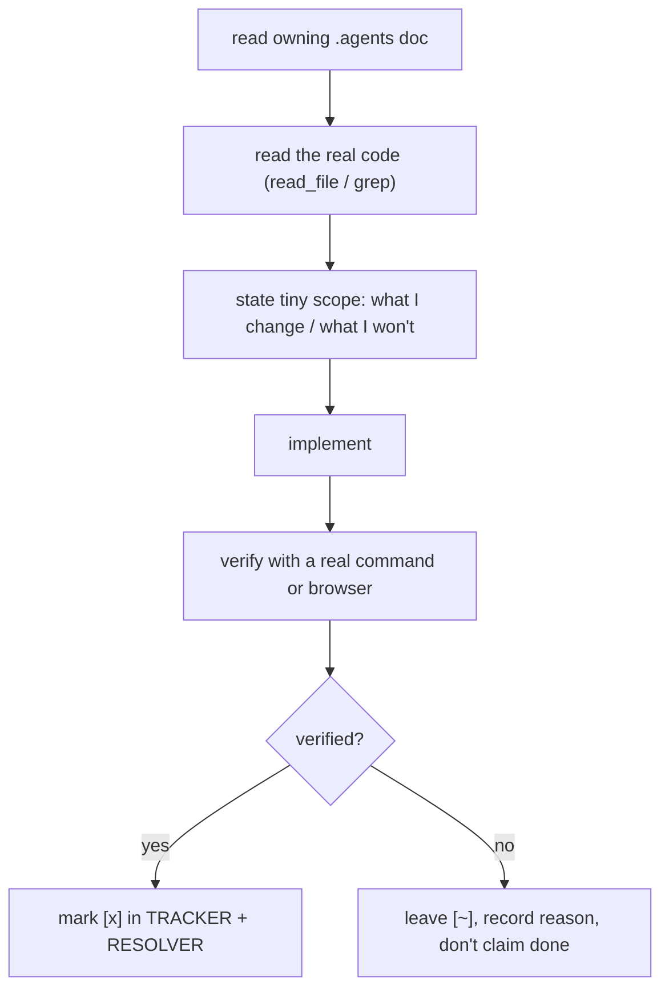

# Goble execution guide

**Status:** `[x]` adopted
**Owns:** how the model should work in this repo so implementations are precise, not lazy.
**Depends on:** [`RESOLVER.md`](RESOLVER.md), [`TRACKER.md`](TRACKER.md)

This repo is large and ambitious. The failure mode we most want to avoid is the model being **handed too much and silently omitting parts**. The fix is strict scoping + mandatory verification. Read this before doing any implementation.

## Slice work

- Resolve **exactly one** discrete item from `TRACKER.md` per turn. Never attempt "the whole subsystem" in one go.
- If an item is too big to implement and verify in one turn, **split it in its owning doc** into smaller self-contained items first, then do one.
- Pick the smallest item that is fully defined and unblocked.

## The loop for each item

## Precision rules

1. **Read before writing.** Read the owning doc and the relevant existing code. Do not guess APIs.
2. **Verify to earn `[x]`.** Run the actual check — `cargo test`, `cargo build`, `npx tsc`, `npm test`, or browser interaction for UI. Record it.
3. **No placeholders.** No `TODO: do the rest` or partial wiring left half-correct. Implement fully or leave the item alone.
4. **Keep it scoped.** Match the surrounding code's conventions; don't refactor unrelated code.
5. **UI/rendering work must be exercised** end-to-end in the browser (or, for the wgpu shell, build + run + interact) — a screenshot alone is not verification.
6. **Secrets/keys** are never printed or committed; reference them by id (vault).
7. **Say what you did not verify** and why. Honesty over apparent completeness.
8. **Update the tracker** so the tree stays a live record (this is the resolver's contract).

## When you're unsure

- If an item depends on a decision not yet made, don't guess — record the open question in the owning doc and pick a different (unblocked) item.
- If verification isn't possible in this environment, say so explicitly and leave the item `[~]`.
