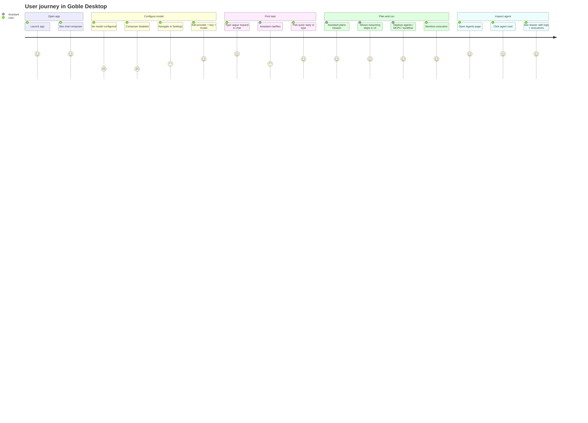
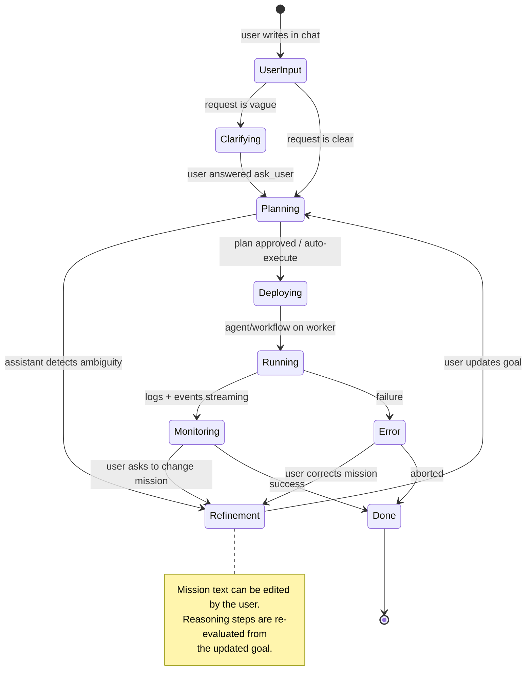
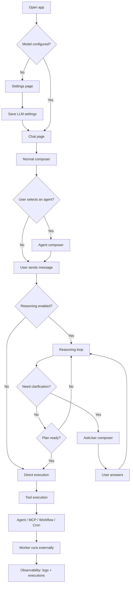
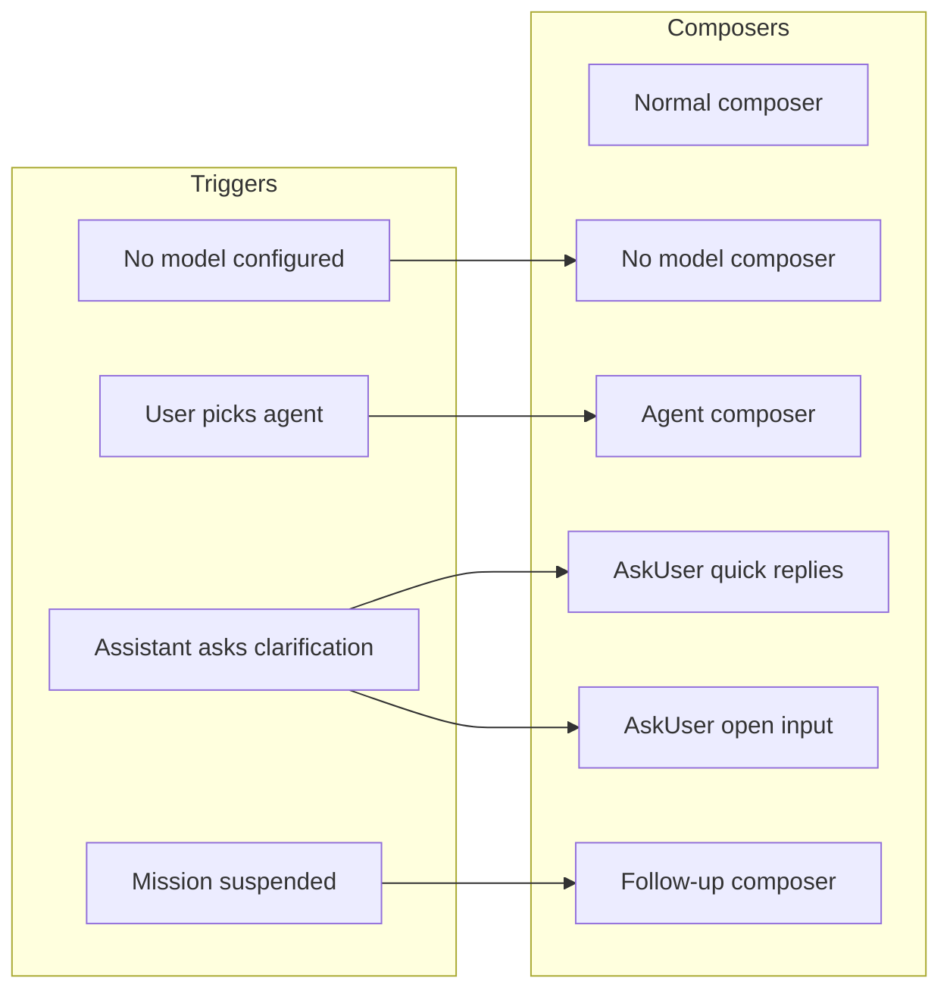
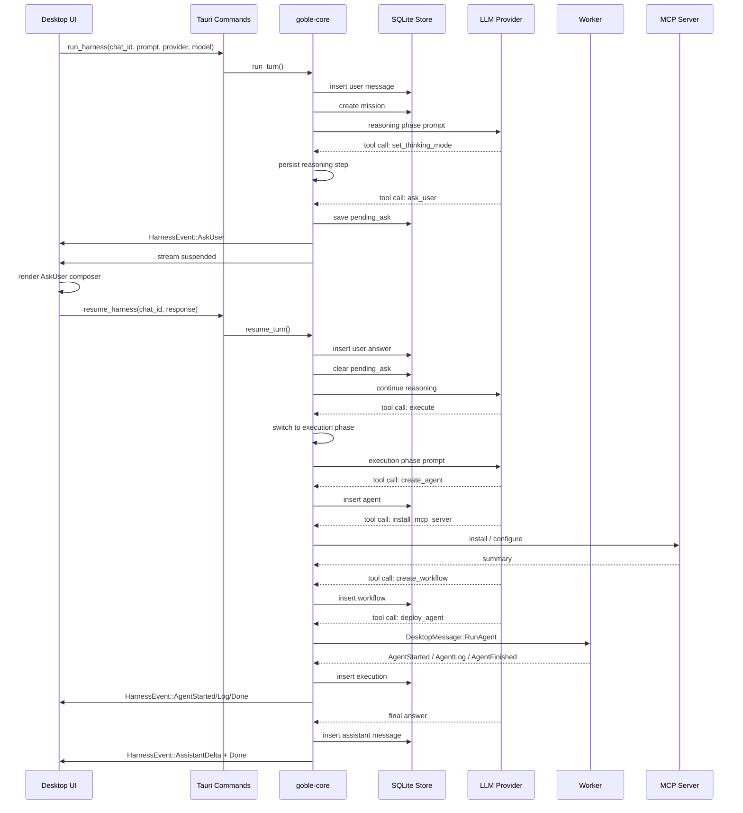
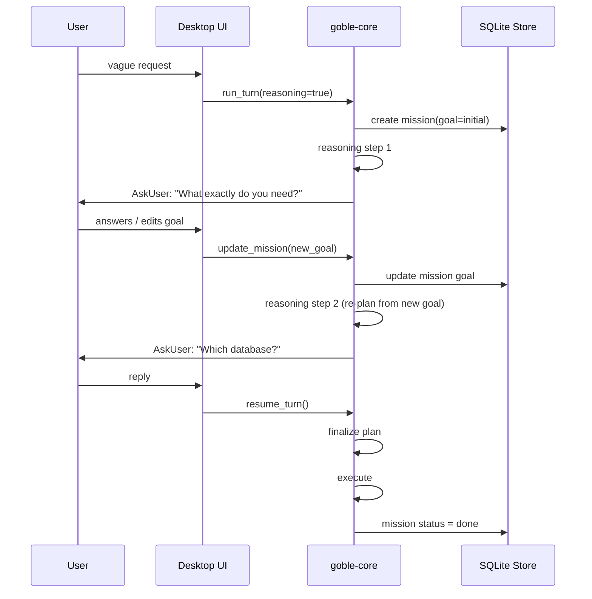
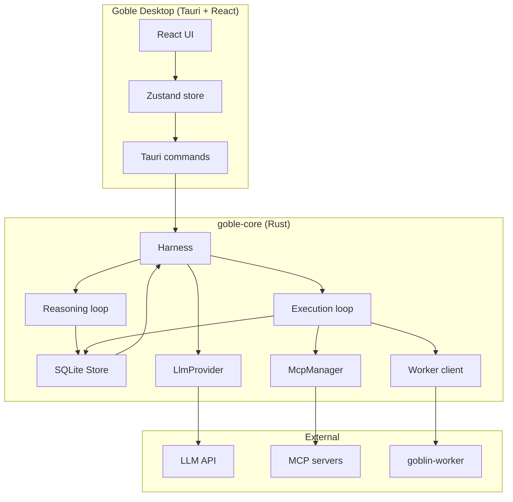
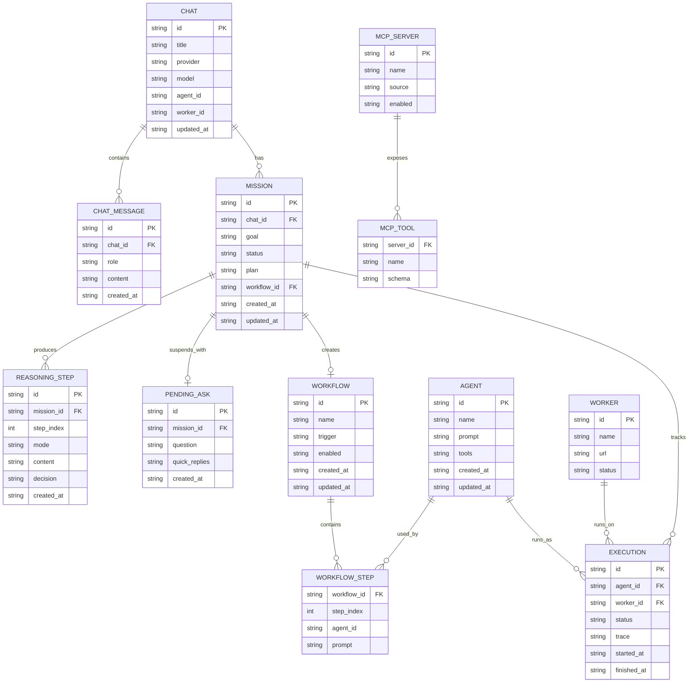
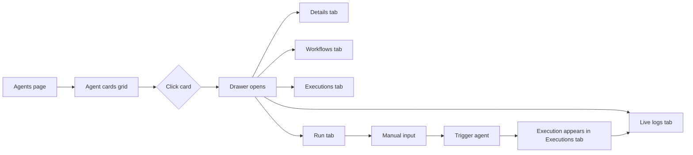
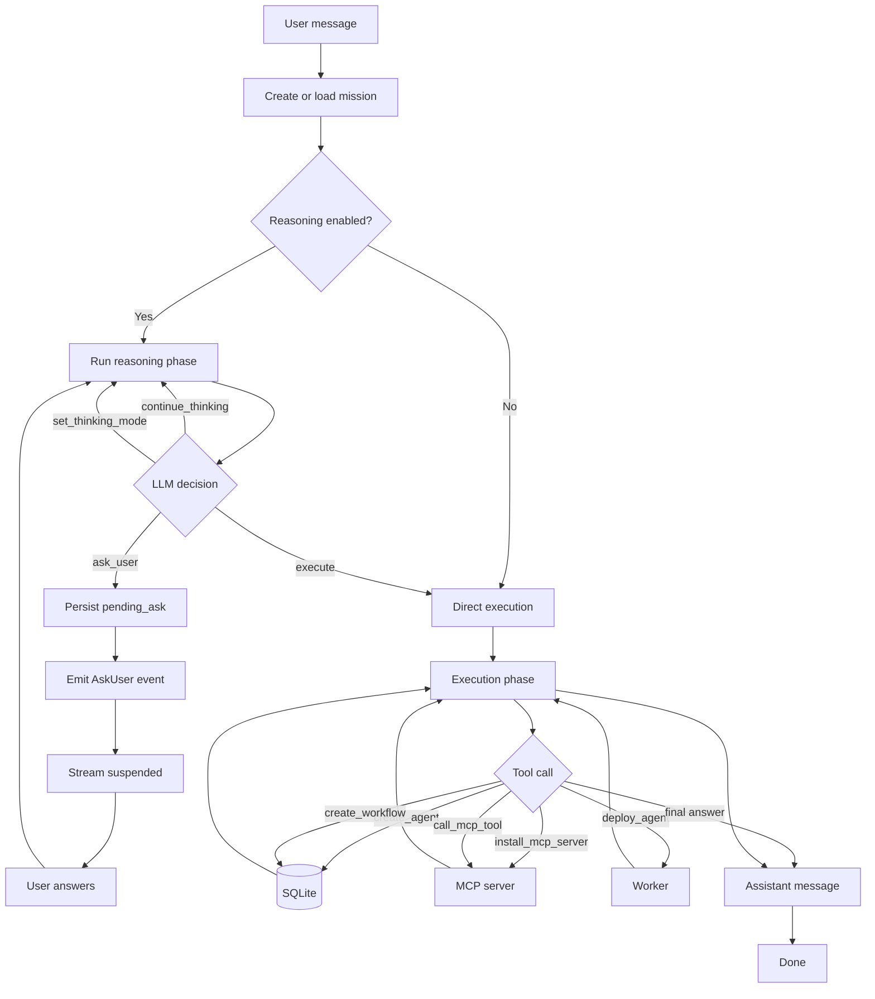

# Goble Agent Orchestration UI/UX Architecture

Date: 2026-08-01
Status: Draft / Implementation started

---

## 1. User journey overview

---

## 2. Mission lifecycle (vague → refined → done)

A mission is not always clear from the first message. The user can refine the goal at any point during the reasoning phase.

---

## 3. UI state transitions

---

## 4. Composer variants

### Composer UI mockups

| Variant | Placeholder | Buttons / extras |
|---------|-------------|------------------|
| Normal | `Ask anything...` | Send, model selector, agent picker |
| No model | `Add a model in Settings first` | Disabled input, link to Settings |
| Agent | `Message to agent {{name}}...` | Agent avatar, clear button, tools hint |
| AskUser quick | Question card shown | Up to 5 quick-reply buttons + "Other" |
| AskUser open | Question as hint | Normal input, focused |
| Follow-up | `Continue the task...` | Resume button, mission status badge |

---

## 5. Reasoning loop architecture

---

## 6. Mission refinement loop

---

## 7. Component architecture

---

## 8. Database entity model

---

## 9. Agents page: card → drawer

---

## 10. Questions and answers (current design intent)

| Question | Answer |
|----------|--------|
| Open GUI as user, no model configured, write in chat | The composer is disabled or the user is redirected to user settings to add a model. |
| Can chat create an agent, connect MCPs, set cron, call that agent externally | Yes. The local chat is an orchestration surface. Agents, MCPs, workflows with cron triggers, and external runs on workers are all available as tools to the local assistant. |
| Can the agent finish complex workflows | Yes, through the reasoning loop and mission tracking. The assistant can plan, ask the user when information is missing, create agents/MCPs/workflows, deploy them, and resume execution later. |
| Do we have observability over it | Yes. Every action is logged: reasoning steps, tool calls, worker runs, executions. The Agents page shows a per-agent drawer with details, workflows, executions and logs. |
| Multiple composer variants / user follow-up | The composer can show quick-reply variants for `ask_user` or switch to a follow-up input when the assistant needs the user to continue a suspended turn. |
| Mission can be vague and refined | Yes. The mission goal is stored separately and can be updated by the user or the assistant during the reasoning phase. Each update triggers a re-plan. |

---

## 11. Composer variants detailed

| Mode | UI |
|------|----|
| Normal | Text input, send button, model selector. |
| No model configured | Input disabled, placeholder `Add a model in Settings`, link to Settings. |
| Agent selected | Text input, placeholder `Message to <agent>`, agent avatar, clear button. |
| AskUser with quick replies | Input hidden, question card, up to N quick-reply buttons + "Other" button that switches to text input. |
| AskUser open | Text input focused, prompt prefixed with the question context. |
| Follow-up after suspension | Input enabled, label `Continue the task...`. |

---

## 12. Core reasoning flow

---

## 13. Next implementation steps

1. **Desktop backend**:
   - Add `resume_harness` command (reuse `run_harness` with `resume_turn`).
   - Add `list_missions` / `get_mission` commands.
   - Wire `HarnessEvent::AskUser`, `ReasoningStarted`, `ReasoningDone`, `MissionUpdated` to the frontend.

2. **Desktop frontend store**:
   - Add `missions`, `pendingAsk` to Zustand.
   - Handle `harness:event` AskUser by switching the composer to quick-reply or follow-up mode.

3. **AgentsPage**:
   - Keep the agent drawer that is already started.
   - Add `Run` tab with manual input + trigger.
   - Add real-time log viewer for the selected agent.

4. **ChatArea**:
   - Disable composer when no model is configured and show a settings link.
   - Add agent selector in chat header.
   - Render `AskUser` events as cards with quick replies.
   - Add `Resume` button when a suspended ask is present.

5. **SettingsPage**:
   - Ensure a global default model is selected; chats inherit it if not set per chat.

---

## 14. Files touched

- `crates/goble-core/src/store.rs` — added `missions`, `reasoning_steps`, `pending_asks` tables and CRUD.
- `crates/goble-core/src/harness.rs` — exposed `with_reasoning`, `run_turn`/`resume_turn` delegate to `reasoning.rs`.
- `crates/goble-core/src/reasoning.rs` — new reasoning loop, `ask_user` suspend/resume, mission tracking.
- `crates/goble-core/src/lib.rs` — added `pub mod reasoning`.
- `crates/goble-desktop/src/pages/AgentsPage.tsx` — agent drawer (details, workflows, executions).

---

## 15. How to view the diagrams

This document uses **Mermaid** diagrams. You can view them in:
- GitHub / GitLab (rendered automatically in markdown previews)
- Obsidian with the Mermaid plugin enabled
- Any Mermaid live editor (https://mermaid.live)
- VS Code with the `Markdown Preview Mermaid Support` extension

To render all diagrams locally, copy the `.md` file into any Mermaid-compatible viewer.

