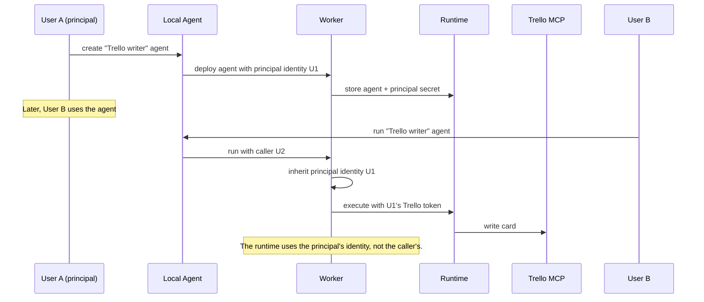

# Goble Agentic System — Local Agent, Worker, Runtime

```mermaid
flowchart TB
    subgraph USER["User"]
        U["Goble Desktop app"]
    end

    subgraph UI["UI — part of goble-core"]
        direction TB
        PAGE["Chat page"]
        COMPOSER["Composer"]
        RENDERER["Chat renderer"]
    end

    subgraph LOCAL["Local Agent — goble-core"]
        direction TB
        LLM["Local LLM connection"]
        RUNNER["Runner"]
        STATE["State: mission, reasoning, executions, checkpoints"]
        RESUME["Conversation resume"]
    end

    subgraph WORKER["Worker — distributed or single VM"]
        direction TB

        subgraph WORKER_CORE["Worker core"]
            W_SECRETS["Secrets store"]
            W_LIBS["Shared libraries"]
            W_MCP_S["MCP servers / shared"]
            W_LLM["LLM provider"]
            W_ORCHESTRATOR["Runtime orchestrator"]
        end

        subgraph RUNTIME_A["Runtime / Agent A"]
            RA_FS["File system"]
            RA_SHELL["Shell / git"]
            RA_PY["Python"]
            RA_MCP["MCP client"]
            RA_AGENT["Agent process"]
        end

        subgraph RUNTIME_B["Runtime / Agent B"]
            RB_FS["File system"]
            RB_SHELL["Shell / git"]
            RB_PY["Python"]
            RB_MCP["MCP client"]
            RB_AGENT["Agent process"]
        end

        W_ORCHESTRATOR --"virtualizes"--> RUNTIME_A
        W_ORCHESTRATOR --"virtualizes"--> RUNTIME_B
        W_SECRETS --"scoped"--> RUNTIME_A
        W_SECRETS --"scoped"--> RUNTIME_B
        W_LIBS --"shared"--> RUNTIME_A
        W_LIBS --"shared"--> RUNTIME_B
        W_MCP_S --"shared"--> RUNTIME_A
        W_MCP_S --"shared"--> RUNTIME_B
        W_LLM --"shared"--> RUNTIME_A
        W_LLM --"shared"--> RUNTIME_B
    end

    subgraph EXTERNAL["External"]
        LLM_API["LLM API"]
        MCP_S["MCP servers"]
        WEB["Web / Git / APIs"]
    end

    U --> PAGE
    PAGE --> COMPOSER
    PAGE --> RENDERER
    COMPOSER --> LLM
    RENDERER --> LLM

    LLM --> LLM_API
    LLM --> RUNNER
    RUNNER --> WORKER
    RUNNER --> STATE
    STATE --> RESUME
    RESUME --> LLM

    WORKER --> W_LLM
    W_LLM --> LLM_API
    W_MCP_S --> MCP_S

    RA_AGENT --> RA_FS
    RA_AGENT --> RA_SHELL
    RA_AGENT --> RA_PY
    RA_AGENT --> RA_MCP
    RA_MCP --> W_MCP_S

    RB_AGENT --> RB_FS
    RB_AGENT --> RB_SHELL
    RB_AGENT --> RB_PY
    RB_AGENT --> RB_MCP
    RB_MCP --> W_MCP_S

    RA_SHELL --> WEB
    RB_SHELL --> WEB

    WORKER --> RENDERER

    style LOCAL fill:#0f172a,stroke:#22d3ee,stroke-width:2px
    style WORKER fill:#0f172a,stroke:#34d399,stroke-width:2px
    style USER fill:#0f172a,stroke:#a78bfa,stroke-width:2px
    style UI fill:#0f172a,stroke:#fbbf24,stroke-width:2px
    style EXTERNAL fill:#0f172a,stroke:#94a3b8,stroke-width:2px
```

## What the Worker really is

The Worker is **not** just a remote executor. It is a full system that can run on a single VM or as a distributed cluster of workers.

Each Worker contains:

- **Secrets store** — scoped to runtimes and identities.
- **Shared libraries** — reused across runtimes to avoid duplication.
- **MCP servers** — shared and pooled, callable by any runtime.
- **LLM provider** — the Worker has its own LLM access, used by the runtime/agent when needed.
- **Runtime orchestrator** — virtualizes and isolates multiple Runtimes / Agents.

Each Runtime / Agent is an isolated execution environment, but it shares libraries, MCPs, and LLM access with the other runtimes on the same Worker for efficiency.

```mermaid
flowchart TB
    subgraph CLUSTER["Worker cluster (one VM or many)"]
        direction TB
        W1["Worker 1"]
        W2["Worker 2"]
        W3["Worker N"]
    end

    subgraph SHARED["Shared across cluster"]
        S1["MCP registry"]
        S2["Library cache"]
        S3["Secret vault (sharded)"]
    end

    W1 --> S1
    W2 --> S1
    W3 --> S1
    W1 --> S2
    W2 --> S2
    W3 --> S2
    W1 --> S3
    W2 --> S3
    W3 --> S3

    style CLUSTER fill:#0f172a,stroke:#34d399,stroke-width:2px
    style SHARED fill:#0f172a,stroke:#fbbf24,stroke-width:2px
```

## Worker components

```mermaid
flowchart LR
    subgraph WORKER["Worker"]
        direction TB
        W1["Secrets"]
        W2["Runtimes / Agents"]
        W3["MCPs"]
        W4["LLM"]
        W5["Libraries"]
        W6["Orchestrator"]
    end

    W1 --> W2
    W3 --> W2
    W4 --> W2
    W5 --> W2
    W6 --> W2

    W1 --> W3
    W4 --> W3

    style WORKER fill:#0f172a,stroke:#34d399,stroke-width:2px
```

| Component | Role |
|---|---|
| Secrets | Scoped credentials for runtimes and identities. |
| Runtimes / Agents | Isolated execution environments. |
| MCPs | Shared MCP servers and clients. |
| LLM | Shared LLM provider for runtime/agent use. |
| Libraries | Shared dependency cache. |
| Orchestrator | Creates, pauses, resumes, destroys runtimes. |

## Local Agent vs Worker responsibilities

| Local Agent (goble-core) | Worker |
|---|---|
| Runs inside the desktop app. | Runs on the remote host or cluster. |
| Owns the primary LLM connection for planning. | Has its own LLM for runtime/agent inference. |
| Renders chat and composer. | Exposes runtime API to the local agent. |
| Plans missions, asks user, resumes conversations. | Executes, isolates, virtualizes runtimes. |
| Deploys agents/workflows to a Worker. | Runs those agents/workflows in a runtime. |
| Manages local state and checkpoints. | Manages runtime state, secrets, MCPs, scheduler. |

## Principal identity inheritance

A workflow or agent can be left without a principal. When another user runs it, the runtime inherits the identity of the principal who created it. This is powerful for shared agents that act on behalf of their creator.

## Why this is one of the most advanced agentic workflow systems

```mermaid
flowchart LR
    A["Local reasoning + UI"] --> B["Distributed worker runtime"]
    B --> C["Virtualized isolated agents"]
    C --> D["Shared MCPs + libraries + LLM"]
    D --> E["Principal identity inheritance"]
    E --> F["Multi-turn resumable missions"]
    F --> A

    style A fill:#0f172a,stroke:#22d3ee,stroke-width:2px
    style B fill:#0f172a,stroke:#34d399,stroke-width:2px
    style C fill:#0f172a,stroke:#34d399,stroke-width:2px
    style D fill:#0f172a,stroke:#fbbf24,stroke-width:2px
    style E fill:#0f172a,stroke:#fb7185,stroke-width:2px
    style F fill:#0f172a,stroke:#22d3ee,stroke-width:2px
```

What makes Goble advanced:

1. **Local brain + remote hands** — the local LLM plans and controls, the worker executes at scale.
2. **Worker as runtime virtualization layer** — not just one process, but a system that can spawn many isolated agent runtimes.
3. **Efficiency through sharing** — libraries, MCPs, and LLM access are pooled across runtimes.
4. **Distributed by design** — a single VM or a cluster of workers, all sharing the same registry and vault.
5. **Principal identity inheritance** — shared agents preserve the creator's identity, enabling delegated workflows.
6. **Resumable multi-turn missions** — the local agent can pause, summarize, checkpoint, and resume complex workflows.
7. **No Hermes in remote** — the worker is our own system, not a remote instance of the local agent.

## Key principles

1. The **Local Agent** is the brain and user interface. It runs inside the desktop app and connects to the LLM.
2. The **Worker** is the execution fabric. It contains LLM, MCPs, secrets, libraries, and an orchestrator that virtualizes runtimes.
3. A **Runtime / Agent** is an isolated execution environment on the Worker, using the user's permissions.
4. **Credentials** are passed through to the Worker once configured, and scoped to runtimes and identities.
5. **MCPs and libraries** are shared across runtimes for efficiency.
6. **Principal identity** can be inherited by callers, enabling shared agents that act on behalf of their creator.
7. **Conversation resume** uses summary + checkpoint, not full history replay.

## How to view

This document uses **Mermaid**. Open in GitHub, GitLab, Obsidian with Mermaid plugin, VS Code with `Markdown Preview Mermaid Support`, or https://mermaid.live.
