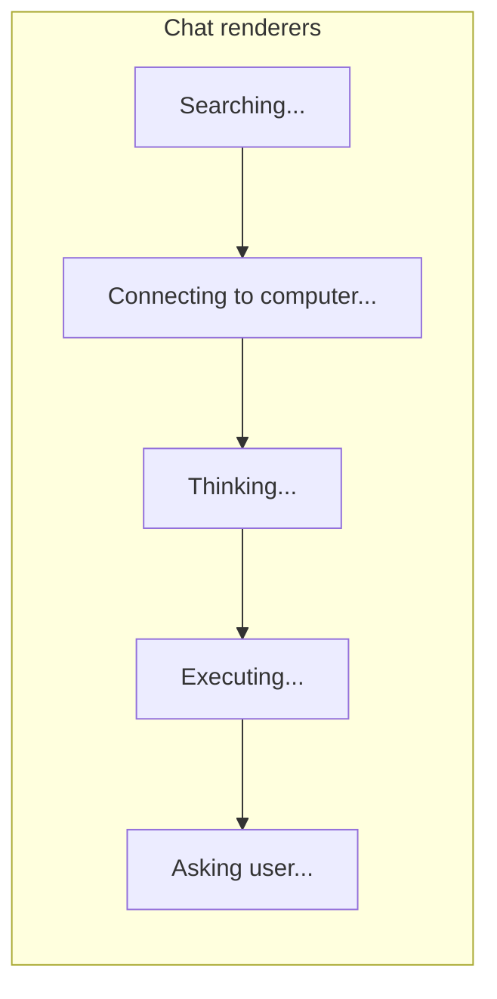
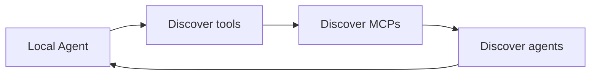
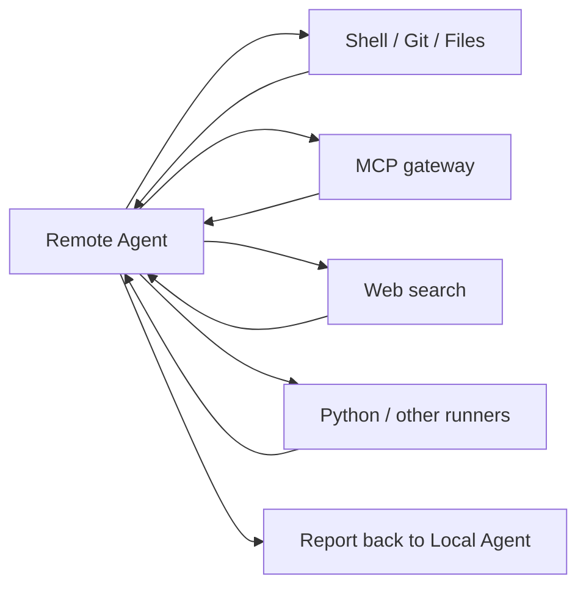
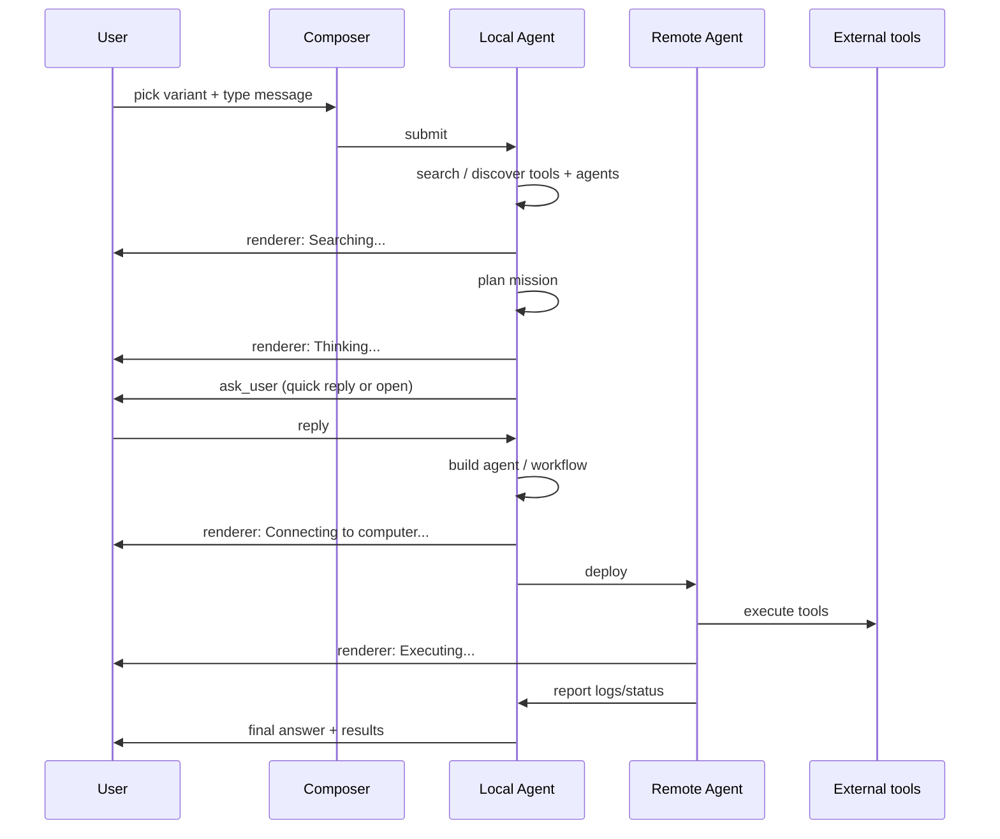

# Goble Local ↔ Remote Agent — High-Level Graph

```mermaid
flowchart TB
    subgraph USER["User"]
        U["Chat / Agents / Settings"]
    end

    subgraph COMPOSER["Custom composer"]
        direction LR
        C1["Variant: ask"]
        C2["Variant: agent"]
        C3["Variant: follow-up"]
        C4["Variant: secrets"]
    end

    subgraph RENDERERS["Chat renderers"]
        direction LR
        R1["Searching..."]
        R2["Connecting to computer..."]
        R3["Thinking..."]
        R4["Executing..."]
        R5["Asking..."]
    end

    subgraph LOCAL["Local Agent — goble-core"]
        direction TB
        L1["Build agent"]
        L2["Discover tools"]
        L3["Discover other agents"]
        L4["Plan mission"]
        L5["Ask user / clarify"]
        L6["Deploy to remote"]
    end

    subgraph REMOTE["Remote Agent — goblin-worker"]
        direction TB
        RR1["Execute tools"]
        RR2["Call MCPs"]
        RR3["Run workflows"]
        RR4["Cron scheduler"]
        RR5["Report back"]
    end

    subgraph EXTERNAL["External"]
        E1["LLM API"]
        E2["MCP servers"]
        E3["Web / Git / Shell"]
    end

    U --> COMPOSER
    COMPOSER --> RENDERERS
    RENDERERS --> LOCAL

    LOCAL --> L1
    L1 --> L2
    L2 --> L3
    L3 --> L4
    L4 --> L5
    L5 --> L6

    L6 --> REMOTE
    REMOTE --> RR1
    RR1 --> RR2
    RR2 --> RR3
    RR3 --> RR4
    RR4 --> RR5

    RR1 --> E3
    RR2 --> E2
    LOCAL --> E1
    RR5 --> RENDERERS

    style LOCAL fill:#0f172a,stroke:#22d3ee,stroke-width:2px
    style REMOTE fill:#0f172a,stroke:#34d399,stroke-width:2px
    style USER fill:#0f172a,stroke:#a78bfa,stroke-width:2px
    style COMPOSER fill:#0f172a,stroke:#fbbf24,stroke-width:2px
    style RENDERERS fill:#0f172a,stroke:#fb923c,stroke-width:2px
    style EXTERNAL fill:#0f172a,stroke:#94a3b8,stroke-width:2px
```

---

## Split in 4 bullets

| Local Agent | Remote Agent |
|---|---|
| Talks to the user, clarifies vague missions, builds agents. | Runs everything it receives: tools, MCPs, workflows, cron. |
| Discovers tools and other agents from the registry. | Interrogates external tools and MCPs locally on its host. |
| Plans, asks when blocked, deploys to remote. | Reports status, logs, results back to local. |
| Owns secrets, config, history. | Owns execution state and scheduler. |

```mermaid
flowchart LR
    subgraph L["Local Agent"]
        L1["Build agent"]
        L2["Discover tools / agents"]
        L3["Plan + ask user"]
        L4["Deploy"]
    end

    subgraph R["Remote Agent"]
        R1["Execute"]
        R2["Call tools / MCPs"]
        R3["Report back"]
    end

    L1 --> L2 --> L3 --> L4 --> R1
    R1 --> R2 --> R3 --> L3

    style L fill:#0f172a,stroke:#22d3ee,stroke-width:2px
    style R fill:#0f172a,stroke:#34d399,stroke-width:2px
```

---

## Custom composer variants

```mermaid
flowchart LR
    subgraph COMPOSER["Composer"]
        C1["Default ask"]
        C2["Agent mode"]
        C3["Secrets mode"]
        C4["Follow-up / resume"]
    end

    U["User"] --> C1
    U --> C2
    U --> C3
    U --> C4

    C1 --> L["Local Agent"]
    C2 --> L
    C3 --> L
    C4 --> L

    style COMPOSER fill:#0f172a,stroke:#fbbf24,stroke-width:2px
    style L fill:#0f172a,stroke:#22d3ee,stroke-width:2px
```

| Variant | When | Extra UI |
|---|---|---|
| Default ask | Normal chat | Text input, model picker, agent picker. |
| Agent mode | User selected an agent | Avatar, system prompt hint, tool filter. |
| Secrets mode | Action needs a secret | Inline secret picker / unlock vault. |
| Follow-up / resume | Mission suspended | Resume button, pending ask badge. |

---

## Chat renderers

| Renderer | Meaning |
|---|---|
| Searching... | Looking up tools, agents, MCPs, docs. |
| Connecting to computer... | Preparing remote worker / local shell. |
| Thinking... | Reasoning loop is planning the mission. |
| Executing... | Running tools or workflows. |
| Asking user... | Need clarification before continuing. |

---

## Local Agent: building an agent

```mermaid
flowchart TD
    A["User says: build an agent"] --> B["Local Agent"]
    B --> C["Choose base / variant"]
    C --> D["Write prompt"]
    D --> E["Select tools"]
    E --> F["Discover tools / MCPs"]
    F --> G["Discover other agents"]
    G --> H["Save agent definition"]
    H --> I["Deploy to Remote Agent"]

    style B fill:#0f172a,stroke:#22d3ee,stroke-width:2px
    style I fill:#0f172a,stroke:#34d399,stroke-width:2px
```

---

## Discovery loop

- **Tools**: list from harness, local tool registry.
- **MCPs**: search registry, install, discover tool schemas.
- **Agents**: list existing agents, combine them into teams/workflows.

---

## Remote Agent: local execution only

The remote agent does **not** ask the user. It executes the plan and reports.

---

## High-level sequence

---

## Key decisions

1. **Local agent is the orchestrator.** It asks, plans, builds, and deploys.
2. **Remote agent is the executor.** It does not ask the user; it only reports back.
3. **Remote interrogates remote.** All external tool calls and MCP calls happen on the worker host.
4. **Composer is context-aware.** It switches variants based on agent, secrets, and suspended asks.
5. **Chat is a render surface.** Searching, connecting, thinking, executing, and asking are all visual states emitted by the local agent.

---

## How to view

This document uses **Mermaid**. Open in GitHub, GitLab, Obsidian with Mermaid plugin, VS Code (`Markdown Preview Mermaid Support`), or https://mermaid.live.
