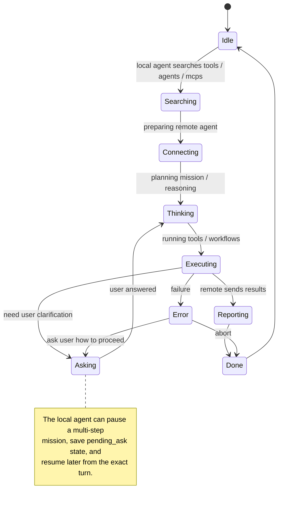
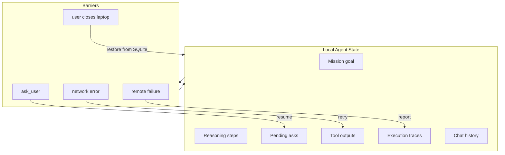
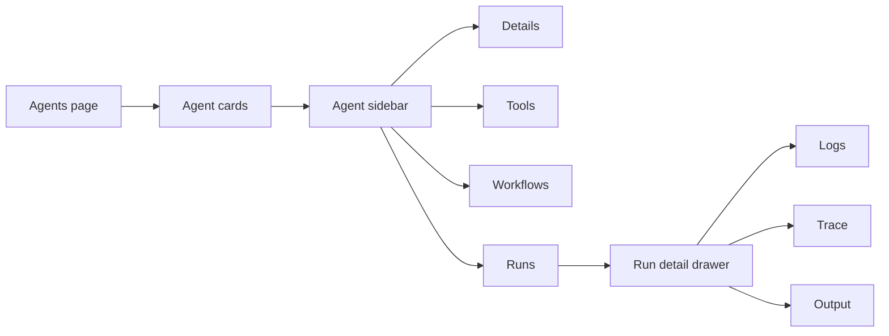

# Goble Agentic System — Local vs Remote Agent Graph

This is the high-level graph of how the **local agent** (Goble Desktop / goble-core) and the **remote agent** (goblin-worker) split responsibilities, what surfaces the chat uses, and how the system handles multi-turn complex workflows.

```mermaid
flowchart TB
    subgraph USER["User"]
        UI["Goble Desktop UI"]
    end

    subgraph CHAT["Chat surfaces"]
        direction LR
        COMPOSER["Composer\n(text input + variants)"]
        RENDERER["Chat renderer\n(messages + states)"]
    end

    subgraph PAGES["Main pages"]
        direction LR
        P_CHAT["Chat"]
        P_AGENT["Agent + sidebar"]
        P_MCP["MCP menu"]
    end

    subgraph LOCAL["Local Agent — goble-core"]
        direction TB
        L_RUNNER["Runner\n(search, query, plan,\nregistry, ask_user, deploy)"]
        L_QUERY["Query layer\nMCPs, secrets,\nagents, tools, models"]
        L_SETTINGS["User settings editor\n(LLM, provider, model, vault)"]
        L_BUILDER["Agent builder\ncreate / edit agents\nand workflows"]
        L_STATE["State\nmission, reasoning steps,\npending asks, executions"]
    end

    subgraph REMOTE["Remote Agent — goblin-worker"]
        direction TB
        R_RUNNER["Runner\n(shell, git, file,\npython, web)"]
        R_FS["File system\n(read, write, edit)"]
        R_MCP["MCP gateway\n(call remote MCPs)"]
        R_CRON["Cron scheduler\ntriggers workflows"]
        R_TASKS["Task store"]
    end

    subgraph EXTERNAL["External"]
        LLM["LLM API"]
        MCP_S["MCP servers"]
    end

    UI --> P_CHAT
    UI --> P_AGENT
    UI --> P_MCP

    P_CHAT --> COMPOSER
    P_CHAT --> RENDERER
    P_AGENT --> L_BUILDER
    P_MCP --> L_QUERY
    L_SETTINGS --> UI

    COMPOSER --> L_RUNNER
    RENDERER --> L_RUNNER

    L_RUNNER --> L_QUERY
    L_RUNNER --> L_BUILDER
    L_RUNNER --> L_SETTINGS
    L_RUNNER --> L_STATE
    L_RUNNER --> LLM

    L_QUERY --> MCP_S

    L_RUNNER --"deploy / control"--> REMOTE
    R_RUNNER --> R_FS
    R_RUNNER --> R_MCP
    R_RUNNER --> R_CRON
    R_RUNNER --> R_TASKS
    R_MCP --> MCP_S
    R_CRON --> R_TASKS

    REMOTE --"logs / status / results"--> RENDERER
    REMOTE --"executions"--> L_STATE

    style LOCAL fill:#0f172a,stroke:#22d3ee,stroke-width:2px
    style REMOTE fill:#0f172a,stroke:#34d399,stroke-width:2px
    style USER fill:#0f172a,stroke:#a78bfa,stroke-width:2px
    style CHAT fill:#0f172a,stroke:#fbbf24,stroke-width:2px
    style PAGES fill:#0f172a,stroke:#fb923c,stroke-width:2px
    style EXTERNAL fill:#0f172a,stroke:#94a3b8,stroke-width:2px
```



---

## Local Agent — what it contains

```mermaid
flowchart TB
    subgraph LOCAL["Local Agent — goble-core"]
        direction TB

        subgraph RUNNER["Runner"]
            R1["search / query"]
            R2["plan mission"]
            R3["ask_user"]
            R4["deploy to remote"]
            R5["control remote subagent"]
            R6["interpret results"]
        end

        subgraph QUERY["Query layer"]
            Q1["MCP registry"]
            Q2["Secrets / vault"]
            Q3["Agent definitions"]
            Q4["Tool definitions"]
            Q5["LLM settings"]
        end

        subgraph BUILDER["Agent builder"]
            B1["Create agent"]
            B2["Edit agent"]
            B3["Create workflow"]
            B4["Discover tools"]
            B5["Discover other agents"]
        end

        subgraph STATE["State"]
            S1["Mission"]
            S2["Reasoning steps"]
            S3["Pending asks"]
            S4["Execution traces"]
            S5["Chat messages"]
        end

        SETTINGS["User settings editor"]
    end

    RUNNER --> QUERY
    RUNNER --> BUILDER
    RUNNER --> SETTINGS
    RUNNER --> STATE

    BUILDER --> QUERY
    B4 --> Q4
    B5 --> Q3

    style LOCAL fill:#0f172a,stroke:#22d3ee,stroke-width:2px
```



The local agent **does not** run Python or filesystem operations. It uses the remote agent for that.

---

## Remote Agent — what it contains

```mermaid
flowchart TB
    subgraph REMOTE["Remote Agent — goblin-worker"]
        direction TB

        subgraph R_RUNNER["Runner"]
            RR1["shell"]
            RR2["git"]
            RR3["file read / write / edit"]
            RR4["python"]
            RR5["web search"]
        end

        R_FS["File system"]
        R_MCP["MCP gateway"]
        R_CRON["Cron scheduler"]
        R_TASKS["Task store"]
        R_HEART["Heartbeat"]
        R_REPORT["Report back"]
    end

    R_RUNNER --> R_FS
    R_RUNNER --> R_MCP
    R_RUNNER --> R_CRON
    R_CRON --> R_TASKS
    R_RUNNER --> R_TASKS
    R_RUNNER --> R_HEART
    R_HEART --> R_REPORT
    R_RUNNER --> R_REPORT

    style REMOTE fill:#0f172a,stroke:#34d399,stroke-width:2px
```



The remote agent does not ask the user. It executes, schedules, and reports.

---

## Chat renderer states



### What the chat renderer displays

| Element | Form |
|---|---|
| User text | Plain bubble |
| Assistant text | Markdown bubble |
| Tool call start | Inline spinner card: `Searching...` / `Connecting to computer...` |
| Tool call result | Collapsible card with output |
| Multi-step progress | Vertical step list with check / spin / error icons |
| Ask user | Question card with quick-reply buttons or open input |
| Agent created | Card with agent name + tools |
| MCP installed | Card with MCP name + status |
| Workflow deployed | Card with trigger + steps |
| Remote execution | Live log stream + execution status |
| Error / retry | Error card with retry button |

---

## Composer variants

```mermaid
flowchart LR
    subgraph COMPOSER["Composer input"]
        direction LR
        C1["Default"]
        C2["Agent selected"]
        C3["Secrets needed"]
        C4["Follow-up / resume"]
        C5["No model configured"]
    end

    U["User"] --> COMPOSER
    COMPOSER --> L["Local Agent"]

    style COMPOSER fill:#0f172a,stroke:#fbbf24,stroke-width:2px
    style L fill:#0f172a,stroke:#22d3ee,stroke-width:2px
```



| Variant | UI |
|---|---|
| Default | Text input, model picker, agent picker. |
| Agent selected | Input shows selected agent, filtered tools, system prompt hint. |
| Secrets needed | Secret picker inline / unlock vault button. |
| Follow-up / resume | Input prefilled with mission context, resume button. |
| No model configured | Disabled input, placeholder: `Add model in Settings`. |

---

## Multi-turn mission flow

```mermaid
sequenceDiagram
    participant U as User
    participant C as Composer
    participant R as Chat renderer
    participant LOC as Local Agent
    REMOTE as Remote Agent
    LLM as LLM API

    U ->> C: "Build a daily report agent"
    C ->> LOC: submit
    LOC ->> R: Searching...
    LOC ->> LLM: plan + ask_user
    LOC ->> R: Thinking...
    LOC ->> R: Asking: "Which database?"
    R ->> U: quick reply buttons
    U ->> C: taps "Postgres"
    C ->> LOC: resume
    LOC ->> R: Searching...
    LOC ->> LLM: re-plan
    LOC ->> LOC: create agent + workflow
    LOC ->> R: Agent created card
    LOC ->> R: Connecting to computer...
    LOC ->> REMOTE: deploy
    REMOTE ->> R: Executing...
    REMOTE ->> R: log stream
    REMOTE ->> LOC: execution trace
    LOC ->> R: Done card

    Note over LOC: Multiple turns can happen before ask_user.
    Note over REMOTE: Remote only executes, never asks.
```

---

## State persistence across barriers



The local agent keeps state in SQLite so a workflow can survive restarts, network failures, and user interruptions.

---

## Agent page sidebar + run details



Each run of the remote agent is shown in the agent page as a detailed execution trace.

---

## Key principles

1. **Local agent = orchestrator + user proxy.** It asks, plans, builds, edits settings, discovers tools/agents, and controls remote subagents.
2. **Remote agent = hands on the computer.** It runs shell, git, filesystem, Python, and MCP tools. It never asks the user.
3. **Local agent has no filesystem / Python access.** It delegates everything executable to the remote agent, even if the remote agent was created ad-hoc.
4. **Chat is the main UI.** Composer = input. Renderer = output + multi-step states.
5. **Multi-turn is normal.** The local agent runs many LLM turns before pausing for `ask_user`.
6. **State is durable.** Missions, reasoning steps, pending asks, and executions are persisted so the system can resume across barriers.
7. **Agent page shows remote runs.** The remote subagent's execution traces live in the agent sidebar/run detail drawer.

---

## How to view

This document uses **Mermaid**. Open in GitHub, GitLab, Obsidian with Mermaid plugin, VS Code with `Markdown Preview Mermaid Support`, or https://mermaid.live.
