# Goble Local ↔ Remote Agent Graph

```mermaid
flowchart TB
    subgraph USER["User"]
        U["Goble Desktop app"]
    end

    subgraph UI["UI — part of goble-core"]
        direction TB
        PAGE["Chat page"]
        COMPOSER["Composer\n(default / agent / secrets / resume / no model)"]
        RENDERER["Chat renderer\n(text, tool cards, multi-step, ask_user, logs)"]
    end

    subgraph LOCAL["Local Agent — goble-core"]
        direction TB
        LLM["Local LLM connection"]
        RUNNER["Runner"]

        subgraph LOCAL_TOOLS["Tools that call remote runtime"]
            T1["ask_computer"]
            T2["read_file"]
            T3["execute_code"]
            T4["list_processes"]
            T5["call_remote_mcp"]
        end

        STATE["State:\nmission, reasoning,\nexecutions, checkpoints"]
        RESUME["Conversation resume\nsummary + checkpoint"]
    end

    subgraph REMOTE["Remote Runtime — goblin-worker"]
        direction TB
        RA["Remote Agent\n(autonomous)"]
        R_FS["File system"]
        R_SHELL["Shell / git"]
        R_PY["Python runtime"]
        R_MCP["MCP gateway"]
        R_CRON["Cron scheduler"]
        R_HTTP["Hermes runtime API"]
    end

    subgraph EXTERNAL["External"]
        LLM_API["LLM API"]
        MCP_S["MCP servers"]
    end

    U --> PAGE
    PAGE --> COMPOSER
    PAGE --> RENDERER
    COMPOSER --> LLM
    RENDERER --> LLM

    LLM --> RUNNER
    RUNNER --> LOCAL_TOOLS
    LOCAL_TOOLS --"HTTP / WebSocket"--> R_HTTP

    LLM --> LLM_API

    R_HTTP --> R_FS
    R_HTTP --> R_SHELL
    R_HTTP --> R_PY
    R_HTTP --> R_MCP
    R_HTTP --"modifies state"--> RA

    RA --> R_FS
    RA --> R_SHELL
    RA --> R_PY
    RA --> R_MCP
    RA --> R_CRON

    R_MCP --> MCP_S

    R_HTTP --> RENDERER
    RA --> RENDERER

    RUNNER --> STATE
    STATE --> RESUME
    RESUME --> LLM

    style LOCAL fill:#0f172a,stroke:#22d3ee,stroke-width:2px
    style REMOTE fill:#0f172a,stroke:#34d399,stroke-width:2px
    style USER fill:#0f172a,stroke:#a78bfa,stroke-width:2px
    style UI fill:#0f172a,stroke:#fbbf24,stroke-width:2px
    style EXTERNAL fill:#0f172a,stroke:#94a3b8,stroke-width:2px
```

## Split

| Local Agent (goble-core) | Remote Runtime (goblin-worker) |
|---|---|
| Runs inside the Goble Desktop app. | Runs on the configured worker host. |
| Owns the LLM connection. | Owns the execution environment. |
| Chat page = composer + renderer. | Exposes Hermes runtime API. |
| Plans, asks user, builds agents, resumes conversations. | Runs shell, git, filesystem, Python, MCPs, cron. |
| Calls remote tools directly: `read_file`, `execute_code`, `ask_computer`, etc. | Executes those calls, reports output and state. |
| Keeps local state: mission, reasoning, checkpoints. | Keeps remote state: files, processes, cron, remote agent. |

## Credential passthrough

Once a worker is configured, local credentials (vault secrets, LLM keys, MCP tokens) are passed through to the worker by default. The local agent decides when to send them, but the default is transparent passthrough.

```mermaid
flowchart LR
    L["Local vault"] --"passthrough"--> W["Worker runtime"]
    L --"LLM API key"--> W
    L --"MCP tokens"--> W

    style L fill:#0f172a,stroke:#22d3ee,stroke-width:2px
    style W fill:#0f172a,stroke:#34d399,stroke-width:2px
```

## Local Agent tool categories

```mermaid
flowchart LR
    subgraph RUNNER["Local Agent Runner"]
        R1["ask_user"]
        R2["ask_computer"]
        R3["read_file"]
        R4["execute_code"]
        R5["list_processes"]
        R6["call_remote_mcp"]
        R7["create_agent"]
        R8["deploy_agent"]
        R9["update_mission"]
    end

    style RUNNER fill:#0f172a,stroke:#22d3ee,stroke-width:2px
```

## Composer variants

| Variant | UI |
|---|---|
| Default | Text input, model picker, agent picker. |
| Agent selected | Shows selected agent, filtered tools, system prompt hint. |
| Secrets needed | Inline secret picker / unlock vault. |
| Follow-up / resume | Mission context, resume button. |
| No model configured | Disabled input, link to Settings. |

## Chat renderer states

| State | Meaning |
|---|---|
| Searching | Looking up tools, agents, MCPs, files. |
| Connecting | Preparing remote runtime / worker. |
| Thinking | Reasoning / planning mission. |
| Executing | Running tools or workflows. |
| Asking | Needs user clarification. |
| Done / Error | Final or error state. |

## Key principles

1. The local agent is the **brain**. It runs inside the desktop app and connects to the LLM.
2. The remote runtime is the **hands**. It runs on the worker and exposes a Hermes tool API.
3. The local agent can inspect and modify the remote runtime state in real time.
4. The remote agent runs autonomously, but the local agent can control it.
5. Local credentials are passthrough to the worker by default once configured.
6. Conversation is resumed via summary + checkpoint, not by sending full history to the LLM.

## How to view

This document uses **Mermaid**. Open in GitHub, GitLab, Obsidian with Mermaid plugin, VS Code with `Markdown Preview Mermaid Support`, or https://mermaid.live.
