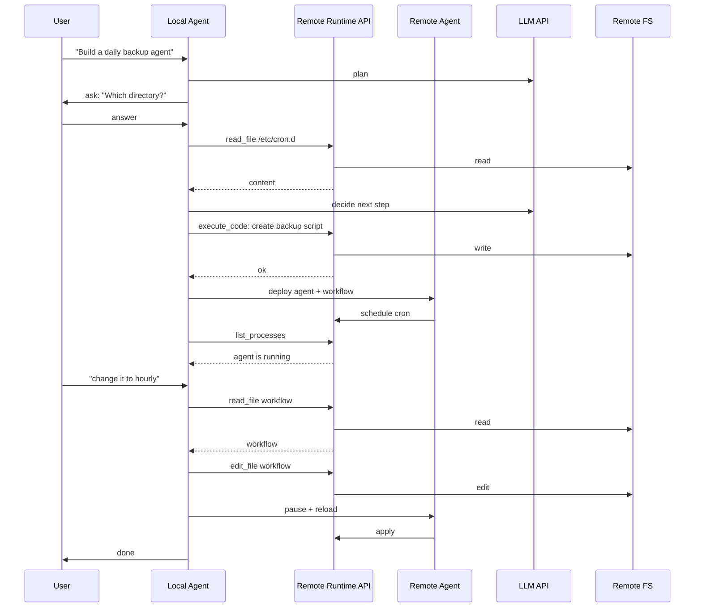

# Goble Agentic Runtime — Local Agent Controls Remote Runtime

This document describes the new architecture: the **local agent** does not just send tasks to the remote agent and wait. It opens a live connection to the **remote runtime** and uses tools like `read_file`, `execute_code`, `ask_computer` directly on that runtime, in parallel with the remote agent.

The local LLM still decides. The remote LLM does not reason. The remote agent is an autonomous process, but its runtime state can be inspected and modified by the local agent.

```mermaid
flowchart TB
    subgraph USER["User"]
        U["Goble Desktop UI"]
    end

    subgraph CHAT["Chat"]
        C1["Composer"]
        C2["Renderer"]
    end

    subgraph LOCAL["Local Agent — goble-core"]
        direction TB
        LLM["Local LLM"]
        RUNNER["Runner"]
        TOOLS["Local tools"]
        STATE["Mission / reasoning / chat state"]
        RESUME["Conversation resume\nsummary + checkpoint"]

        subgraph LOCAL_TOOLS["Tools that talk to remote runtime"]
            T1["ask_computer"]
            T2["read_file"]
            T3["execute_code"]
            T4["list_processes"]
            T5["call_remote_mcp"]
        end
    end

    subgraph REMOTE["Remote Runtime — goblin-worker"]
        direction TB
        R_AGENT["Remote Agent\n(autonomous)"]
        R_FS["File system"]
        R_SHELL["Shell / git"]
        R_PY["Python runtime"]
        R_MCP["MCP gateway"]
        R_CRON["Cron scheduler"]
        R_HTTP["Hermes HTTP runtime API"]
    end

    subgraph EXTERNAL["External"]
        LLM_API["LLM API (used by local agent)"]
        MCP_S["MCP servers"]
    end

    U --> C1
    C2 --> U

    C1 --> LLM
    LLM --> RUNNER
    RUNNER --> TOOLS
    TOOLS --> LOCAL_TOOLS
    LOCAL_TOOLS --"HTTP / WebSocket"--> R_HTTP

    LLM --> LLM_API
    R_HTTP --> R_FS
    R_HTTP --> R_SHELL
    R_HTTP --> R_PY
    R_HTTP --> R_MCP
    R_MCP --> MCP_S

    R_AGENT --> R_FS
    R_AGENT --> R_SHELL
    R_AGENT --> R_PY
    R_AGENT --> R_MCP
    R_AGENT --> R_CRON

    R_HTTP --"modifies state"--> R_AGENT

    LLM --> STATE
    STATE --> RESUME
    RESUME --> LLM

    style LOCAL fill:#0f172a,stroke:#22d3ee,stroke-width:2px
    style REMOTE fill:#0f172a,stroke:#34d399,stroke-width:2px
    style USER fill:#0f172a,stroke:#a78bfa,stroke-width:2px
    style CHAT fill:#0f172a,stroke:#fbbf24,stroke-width:2px
    style EXTERNAL fill:#0f172a,stroke:#94a3b8,stroke-width:2px
```



---

## The dilemma we are solving

In most commercial systems, the remote agent is a black box. You send it a task, it runs its own LLM, and returns a result. The local UI cannot inspect or steer the runtime while the remote agent is running.

Goble does something different:

- The **local agent** owns the LLM.
- The **remote runtime** owns the execution environment.
- The local agent can open a parallel connection to the remote runtime and call `read_file`, `execute_code`, `ask_computer`, etc. at any time.
- This means the local agent can inspect what the remote agent is doing, read its files, fix its state, and continue the mission.

The remote agent still exists as an autonomous process. It can run workflows, cron jobs, and self-heal. But the local agent can reach into its runtime and modify its state.

---

## Local Agent tools that talk to the remote runtime

```mermaid
flowchart LR
    L["Local Agent"] --> ask_computer
    L --> read_file
    L --> execute_code
    L --> list_processes
    L --> call_remote_mcp

    ask_computer --> R["Remote Runtime API"]
    read_file --> R
    execute_code --> R
    list_processes --> R
    call_remote_mcp --> R

    R --> FS["File system"]
    R --> SHELL["Shell"]
    R --> PY["Python"]
    R --> MCP["MCP gateway"]
    R --> AGENT["Remote Agent state"]

    style L fill:#0f172a,stroke:#22d3ee,stroke-width:2px
    style R fill:#0f172a,stroke:#34d399,stroke-width:2px
```



| Tool | What it does |
|---|---|
| `ask_computer` | Send a high-level question/goal to the remote runtime and get back a structured answer. |
| `read_file` | Read any file from the remote runtime filesystem. |
| `execute_code` | Run a Python or shell snippet on the remote runtime. |
| `list_processes` | See what the remote agent / remote runtime is currently running. |
| `call_remote_mcp` | Call an MCP tool that is installed on the remote runtime, not locally. |

None of these tools ask the remote LLM to think. They just execute. The local LLM decides when to call them.

---

## Remote Runtime Hermes API

```mermaid
flowchart TB
    subgraph R_API["Remote Runtime API"]
        A1["POST /runtime/read_file"]
        A2["POST /runtime/execute_code"]
        A3["POST /runtime/ask_computer"]
        A4["POST /runtime/call_mcp"]
        A5["POST /runtime/list_processes"]
        A6["POST /runtime/write_file"]
        A7["POST /runtime/edit_file"]
        A8["POST /runtime/agent/control"]
        A9["POST /runtime/agent/pause"]
        A10["POST /runtime/agent/resume"]
        A11["GET /runtime/agent/state"]
    end

    A8 --> AGENT["Remote Agent"]
    A9 --> AGENT
    A10 --> AGENT
    A11 --> AGENT
    A1 --> FS["File system"]
    A6 --> FS
    A7 --> FS
    A2 --> RUNNER["Tool runner"]
    A3 --> RUNNER
    A4 --> MCP["MCP gateway"]
    A5 --> PROC["Process manager"]

    style R_API fill:#0f172a,stroke:#34d399,stroke-width:2px
```



The remote runtime exposes a Hermes-like HTTP API. It is not a chat API. It is a tool API. The local agent calls it as a tool.

---

## Remote Agent vs Remote Runtime

```mermaid
flowchart LR
    subgraph REMOTE["Remote host"]
        RA["Remote Agent\nautonomous process"]
        RT["Remote Runtime API\nstateful tool executor"]
        FS["File system"]
        SCHED["Cron scheduler"]
    end

    RA --> RT
    RA --> FS
    RA --> SCHED
    RT --> FS

    L["Local Agent"] --"controls"--> RT
    L --"deploys / monitors"--> RA

    style L fill:#0f172a,stroke:#22d3ee,stroke-width:2px
    style REMOTE fill:#0f172a,stroke:#34d399,stroke-width:2px
```



| Concept | Role |
|---|---|
| Remote Agent | An autonomous process that runs workflows, cron jobs, and tools. It has its own state. |
| Remote Runtime | The execution environment that both the remote agent and the local agent share. The local agent can inspect and modify it. |

---

## Conversation resume: summary + checkpoint

```mermaid
flowchart TB
    subgraph CONV["Long conversation"]
        M1["Turn 1-10"]
        M2["Turn 11-30"]
        M3["Turn 31-50"]
        M4["Turn 51-N"]
    end

    M1 --> S1["Summary 1 + checkpoint"]
    M2 --> S2["Summary 2 + checkpoint"]
    M3 --> S3["Summary 3 + checkpoint"]

    S1 --> R1["Resume context"]
    S2 --> R1
    S3 --> R1

    R1 --> LLM["Local LLM continues\nwith compressed history"]

    style CONV fill:#0f172a,stroke:#fbbf24,stroke-width:2px
    style R1 fill:#0f172a,stroke:#22d3ee,stroke-width:2px
```



When a conversation becomes long, the local agent does not send all messages to the LLM. It compresses older turns into:

- **Summary**: key decisions, facts, failures, successes.
- **Checkpoint**: exact state of the mission, files, variables, pending asks, and execution traces at that point.

The LLM continues with the summary + checkpoint + recent turns. The full history is still stored in SQLite for the UI, but it is not all sent to the LLM context.

---

## How a complex mission works



Notice: the local agent uses `read_file`, `execute_code`, `list_processes`, and `edit_file` directly on the remote runtime, while the remote agent also runs autonomously.

---

## State ownership

```mermaid
flowchart LR
    subgraph LOCAL["Local Agent"]
        L1["Mission goal"]
        L2["Reasoning steps"]
        L3["Pending asks"]
        L4["Resume summaries + checkpoints"]
        L5["Chat history"]
    end

    subgraph REMOTE["Remote Runtime"]
        R1["Remote Agent state"]
        R2["File system state"]
        R3["Cron tasks"]
        R4["Running processes"]
    end

    LOCAL --"controls"--> REMOTE
    REMOTE --"reports"--> LOCAL

    style LOCAL fill:#0f172a,stroke:#22d3ee,stroke-width:2px
    style REMOTE fill:#0f172a,stroke:#34d399,stroke-width:2px
```



- **Local agent owns** the plan, the user conversation, the mission summary, and the checkpoint.
- **Remote runtime owns** the actual execution state: files, processes, cron jobs, and the remote agent's own state.
- The local agent can modify the remote runtime state at any time.

---

## How this differs from commercial systems

```mermaid
flowchart TB
    subgraph COMMERCIAL["Commercial agent: remote is a black box"]
        C1["User sends task"] --> C2["Remote agent runs LLM + tools"]
        C2 --> C3["Result returns"]
        C3 --> C1
    end

    subgraph GOBLE["Goble: local controls remote runtime"]
        G1["User sends task"] --> G2["Local LLM plans"]
        G2 --> G3["Local agent uses tools on remote runtime"]
        G3 --> G4["Remote agent also runs autonomously"]
        G4 --> G2
        G2 --> G1
    end

    C2 -.different.-> G3

    style COMMERCIAL fill:#0f172a,stroke:#fb7185,stroke-width:2px
    style GOBLE fill:#0f172a,stroke:#22d3ee,stroke-width:2px
```



Most systems either:
- Run everything remotely with a remote LLM (Claude Code, etc.).
- Run everything locally with no remote runtime.

Goble combines both: the **brain is local**, the **hands are remote**, and the local brain can directly manipulate the remote hands without asking the remote brain.

---

## Key design decisions

1. **Local LLM is the only planner.** The remote agent does not use its own LLM for reasoning.
2. **Remote runtime is a Hermes-like tool API.** It exposes `read_file`, `execute_code`, `ask_computer`, etc. over HTTP.
3. **Local agent can call remote tools in parallel with the remote agent.** Both share the same runtime state.
4. **Conversation resume compresses history.** The local agent keeps a summary + checkpoint to survive long conversations without losing context.
5. **Remote agent remains autonomous.** It can run cron jobs and workflows even when the local laptop is closed. The local agent resumes control when it reconnects.
6. **No local filesystem / Python access.** The local agent uses the remote runtime for all code execution and file operations.

---

## Proposed protocol sketch

```http
POST /runtime/read_file
{
  "path": "/home/user/project/main.py",
  "limit": 100
}

POST /runtime/execute_code
{
  "language": "python",
  "code": "print(open('/etc/os-release').read())",
  "timeout": 30
}

POST /runtime/ask_computer
{
  "goal": "find the largest file in /home/user/project",
  "tools": ["shell", "read_file"]
}

POST /runtime/agent/control
{
  "action": "pause",
  "agent_id": "..."
}

GET /runtime/agent/state
{
  "agent_id": "..."
}
```

Responses are streamed as tool output so the local agent can monitor long-running commands.

---

## Next steps to implement this

1. **Remote runtime API** in `goblin-worker`: add `/runtime/*` endpoints for file, code, mcp, and agent control.
2. **Local tools** in `goble-core`: implement `read_file`, `execute_code`, `ask_computer`, `call_remote_mcp`, `list_processes` that call the remote runtime API.
3. **Remote runtime client** in `goble-core`: HTTP/WebSocket client with cluster identity authentication.
4. **Conversation resume**: implement summarization + checkpointing in the reasoning loop.
5. **Chat renderer**: show remote tool calls as live cards with output streams.
6. **Remote agent state inspector**: in the agent sidebar, show remote runtime state, processes, and file tree.

---

## How to view

This document uses **Mermaid**. Open in GitHub, GitLab, Obsidian with Mermaid plugin, VS Code with `Markdown Preview Mermaid Support`, or https://mermaid.live.
